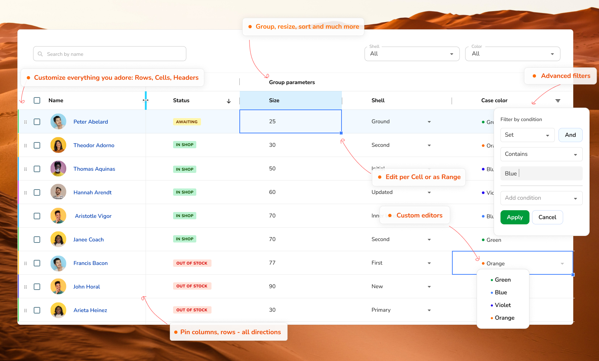

<p align="center">
  <a href="https://revolist.github.io/revogrid">
    
  </a>
</p>

##

<p align="center">
  <a href="https://www.npmjs.com/package/@revolist/revogrid"></a>
  <a href="https://github.com/revolist/revogrid/blob/master/LICENSE"></a>
  
  
</p>
<h4 align="center">Powerful data grid component built with <a href="https://stenciljs.com" target="_blank">StencilJS</a>.</h4>
<p align="center">
Support Millions of cells and thousands of columns easy and efficiently for fast data rendering. Easy to use.
  
</p>

<p align="center">
  <a href="https://revolist.github.io/revogrid">Demo and API</a> •
  <a href="#key-features">Key Features</a> •
  <a href="#basic-usage">How To Use</a> •
  <a href="#installation">Installation</a> •
  <a href="https://github.com/revolist/revogrid/blob/master/src/components/revo-grid/readme.md">Docs</a> •
  <a href="#license">License</a>
</p>


<i>RevoGrid material theme.</i>
<br>

## Key Features

- Millions of cells viewport with a powerful core in-build by default;
- Keyboard support with excel like focus;
- Super light initial starter . Can be imported with polifill or as module for modern browsers;
- Intelligent Virtual DOM and smart rgRow recombination in order to achieve less redraws;
- Sorting (multiple options, can be customized per column and advanced with events);
- Filtering
  - Predefined system filters;
  - Preserve existing collection;
  - Custom filters (extend existing system filters with your own set);
- Export to file;
- Custom sizes per Column and Row;
- Column resizing;
- Autosize support (Column size based on content);
- Pinned/Sticky/Freezed:
  - Columns (define left or right);
  - Rows (define top or bottom);
- Grouping:
  - Column grouping (Nester headers);
  - Row grouping (Nested rows);
- Cell editing;
- Customizations:
  - Header template;
  - Cell template (build your own cell view);
  - Cell editor (apply your own editors and cell types);
  - Cell properties (build you own properties around rendered cells);
- [Column types](https://revolist.github.io/revogrid/guide/column.types.html);
  - Text/String (default);
  - Number;
  - Select;
  - Date;
  - Custom (take any type as template and create your own extended style);
- Drag and drop rows;
- Range operations:
  - Selection;
  - Edit;
- Theme packages:
  - Excel like (default)
  - Material (compact, dark or light);
- Copy/Paste (copy/paste from Excel, Google Sheets or any other sheet format);
- Easy extenation and support with modern VNode features and tsx support;
- Trimmed rows (hide rows on demand);
- Plugin system (create your own plugins or extend existing one, it's transparent and easy);
- Automated size calculation;
- Hundred others small customizations and improvements [RevoGrid](https://revolist.github.io/revogrid).

## Overview


The RevoGrid component helps represent a huge amount of data in a form of data table "excel like" or as list. On top of it it provides inbuilt range edit or per cell edit, keyboard support and custom edit and render features. Works in any major framework or with no framework at all.
<br>

|  |  |  |  |  |
| ---------------------------------------------------------------------------------------- | ------------------------------------------------------------------------------------------- | ---------------------------------------------------------------------------------------- | ------------------------------------------------------------------------------------- | ---------------------------------------------------------------------------------- |
| Latest ✔                                                                                 | Latest ✔                                                                                    | Latest ✔                                                                                 | Latest ✔                                                                              | Latest ✔                                                                           |

## Installation

The library published as a [scoped NPM package](https://docs.npmjs.com/misc/scope) in the [NPMJS Revolist account](https://www.npmjs.com/org/revolist).
[Check for more info on our demo side](https://revolist.github.io/revogrid/guide/installing.html).

With NPM:

```bash
npm i @revolist/revogrid --save;
```

With Yarn:

```bash
yarn add @revolist/revogrid;
```

## Framework

- [JavaScript](https://revolist.github.io/revogrid/guide);
- [VueJs](https://revolist.github.io/revogrid/guide/framework.vue.overview.html);
- [Svelte](https://revolist.github.io/revogrid/guide/framework.svelte.overview.html);
- [React](https://revolist.github.io/revogrid/guide/framework.react.overview.html);
- [Angular](https://revolist.github.io/revogrid/guide/framework.angular.overview.html);
- [Ember](docs/ember.md).

## Basic Usage

Grid works as web component.
All you have to do just to place component on the page and access it properties as an element.
We provide many ways to integrate our grid in your project:

- [Import grid to your index.html file](./docs/indexhtml.md);
- [Import as module with lazy loading](./docs/indexmodule.md);
- [Import inside builders like webpack using lazy loading module](./docs/webpack.md);
- [Import as esm module without lazy loading](./docs/custom.element.md);


### Vanilla Js grid usage

```javascript
const grid = document.querySelector('revo-grid');
const columns = [
  { prop: 'name', name: 'First column' },
  {
    prop: 'details',
    name: 'Second column',
    cellTemplate: (createElement, props) => {
      return createElement('div',
        {
          style: { backgroundColor: 'red' },
          class: { 'inner-cell': true },
        },
        props.model[props.prop] || '',
      );
    },
  },
];
const items = [{ name: 'New item', details: 'Item description' }];
grid.columns = columns;
grid.source = items;
```

## Framework usage VueJs example

```vue
<template>
  <v-grid :source="rows" :columns="columns"/>
</template>

<script>
import VGrid from '@revolist/vue-datagrid';
export default {
  name: 'App',
  data() => ({
      columns: [
        { prop: 'name', name: 'First' },
        { prop: 'details', name: 'Second' },
      ],
      rows: [{ name: '1', details: 'Item 1' }],
    };
  }),
  components: { VGrid },
};
</script>
```

## Versions
- 2.0+ Introduced plugin system, grouping, sorting and filtering.
- 3.0+ Breaking changes introduced [version](./docs/migration.3.0.md). New component loading and esm modules. Bootstrap support and much [more](./docs/migration.3.0.md).

## Contributing

If you have any idea, feel free to open an issue to discuss a new feature, or fork RevoGrid and submit your changes back to me.

## License

MIT

---
