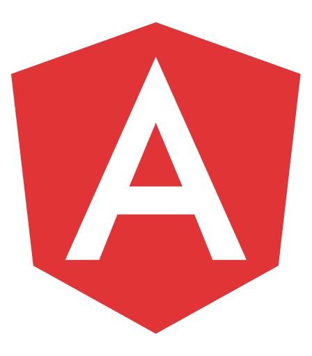

<p align="center">
  <a href="https://rv-grid.com">
    
  </a>
</p>

<h3 align="center">Реактивно быстрая таблица написанная на <a href="https://stenciljs.com" target="_blank">StencilJS</a>.</h3>
<p align="center">
Blazing fast
</p>

## Использование

RevoGrid functions as a web component. Simply place the component on your page and access its properties as you would with any other HTML element. It also offers multiple ways to integrate our grid into your project:

- [Import the grid into your project](https://rv-grid.com/guide/installation)

### JavaScript Data Grid Simple Usage

```javascript
// Select the RevoGrid element from the DOM
const grid = document.querySelector('revo-grid');

// Define the columns for the grid
grid.columns = [{ prop: 'name', name: 'First Column' }, { prop: 'details' }];
// Define the data source for the grid
grid.source = [{ name: 'New Item', details: 'Item Description' }];
```

### Custom cell template

```javascript
// Select the RevoGrid element from the DOM
const grid = document.querySelector('revo-grid');

// Define the columns for the grid
grid.columns = [
  {
    prop: 'name',
    name: 'Custom cell template',
    // Custom cell template
    cellTemplate(h, { value }) {
      return h(
        'div',
        {
          style: { backgroundColor: 'red' }, // Styling the cell background
          class: { 'inner-cell': true }, // Adding a CSS class
        },
        value || '' // Display the cell content or an empty string if undefined
      );
    },
  },
];
// Define the data source for the grid
grid.source = [{ name: 'New Item' }];
```

[Example and guide](https://rv-grid.com/guide/)


- [ Vue 3](https://rv-grid.com/guide/vue3/) and [Vue 2](https://rv-grid.com/guide/vue2/)
- [ React](https://rv-grid.com/guide/react/)
- [ Angular](https://rv-grid.com/guide/angular/)
- [ Svelte](https://rv-grid.com/guide/svelte/)
- [ JavaScript](https://rv-grid.com/guide/)


## License

MIT

---

