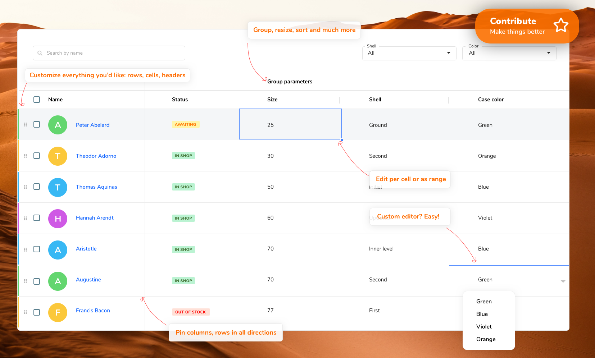
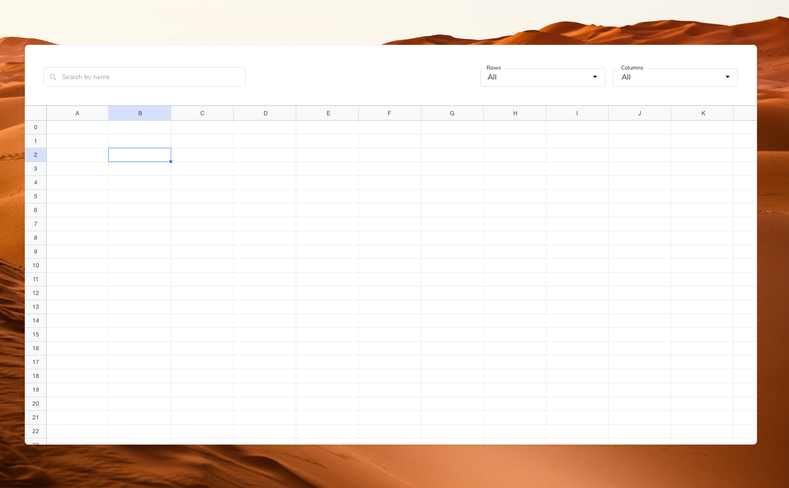

<p align="center">
  <a href="https://revolist.github.io/revogrid.demo.js">
    
  </a>
</p>

##
<p align="center">
  <a href="https://www.npmjs.com/package/@revolist/revogrid"></a>
  <a href="https://github.com/revolist/revogrid/blob/master/LICENSE"></a>
</p>
<h4 align="center">Powerful data grid component built on top of <a href="https://stenciljs.com" target="_blank">StencilJS</a>.</h4>
<p align="center">
Millions of cells and thousands columns easy and efficiently. Any major framework or with no framework at all.
  
</p>

<p align="center">
  <a href="https://revolist.github.io/revogrid.demo.js">Demo and API</a> •
  <a href="#key-features">Key Features</a> •
  <a href="#basic-usage">How To Use</a> •
  <a href="#installation">Installation</a> •
  <a href="https://github.com/revolist/revogrid/blob/master/src/components/revo-grid/readme.md">Docs</a> •
  <a href="#license">License</a>
</p>



<br>


## Key Features

- Millions of cells virtual viewport scroll with a powerful core is in-build by default. 
  Intelligent Virtual DOM and smart row recombination in order to achieve less redraws;
- Column and Row custom sizes;
- Column resizing;
- Pinned columns (columns are always on the left or on the right of the screen);
- Pinned row (rows are always at the top or at the bottom);
- Column grouping;
- Cell editing;
- Custom header renderer;
- Custom cell renderer templates (build your own cell view);
- Custom cell editor (apply your own editors and cell types);
- Custom cell properties;
- Drag and drop rows;
- Column sorting;
- Range selection;
- Range edit;
- Theme packages: Excel like, material, etc;
- Copy/Paste: Copy/paste from Excel, Google Sheets or any other sheet format;
- Easy extenation and support with modern VNode features and tsx support;
- Hundred small customizations and improvements [RevoGrid](https://revolist.github.io/revogrid.demo.js).


## Overview

The RevoGrid component helps represent a huge amount of data in a form of data table "excel like" or as list.
<br>
<p align="center">

</p>

 |  |  |  |  |
--- | --- | --- | --- | --- |
Latest ✔ | Latest ✔ | Latest ✔ | Latest ✔ | Latest ✔ |


## Installation

The library published as a [scoped NPM package](https://docs.npmjs.com/misc/scope) in the [NPMJS Revolist account](https://www.npmjs.com/org/revolist).
[Check for more info on our demo side](https://revolist.github.io/revogrid.demo.js/?path=/docs/docs-installing--page).

With NPM:
```bash
npm i @revolist/revogrid --save;
```

With Yarn:

```bash
yarn add @revolist/revogrid;
```

## Framework

- [JavaScript](docs/vanilajs.md) or [Storybook Demo and Api](https://revolist.github.io/revogrid.demo.js);
- [VueJs](docs/vue.md) or [Storybook Demo and Api](https://revolist.github.io/revogrid.demo.js);
- [React](docs/react.md) or [Storybook Demo and Api](https://revolist.github.io/revogrid.demo.js);
- [Angular](docs/angular.md).
- [Ember](docs/ember.md).


## Basic Usage

Grid works as web component. 
All you have to do just to place component on the page and access it properties as an element.

Add component to your project.

```html
<!DOCTYPE html>
<html>
<head>
```

If you import from node modules:
```html
<script src="node_modules/@revolist/revogrid/dist/revo-grid/revo-grid.js"></script>
```
With unpkg
```html
    <script src="https://cdn.jsdelivr.net/npm/@revolist/revogrid@latest/dist/revo-grid/revo-grid.js"></script>
```

```html
    // Alternatively, if you wanted to take advantage of ES Modules, you could include the components using an import statement. Note that in this scenario applyPolyfills is needed if you are targeting Edge or IE11.
    <script type="module">
      import { defineCustomElements } from 'https://unpkg.com/@revolist/revogrid@latest/loader/index.es2017.js';
      defineCustomElements();
    </script>
</head>
<body>
    <revo-grid class="grid-component"/>
</body>
</html>
```


```javascript
const grid = document.querySelector('revo-grid');
const columns = [
    {
        prop: 'name',
        name: 'First column'
    },
    {
        prop: 'details',
        name: 'Second column',
        cellTemplate: (h, props) => {
          return h('div', {
            style: {
              backgroundColor: 'red'
            },
            class: 'inner-cell'
          }, props.model[props.prop] || '');
        }
    }
];
const items = [{
    name: 'New item',
    details: 'Item description'
}];

grid.columns = columns;
grid.source = items;
```


## Contributing

If you have any idea, feel free to open an issue to discuss a new feature, or fork RevoGrid and submit your changes back to me.


## License

MIT

---

