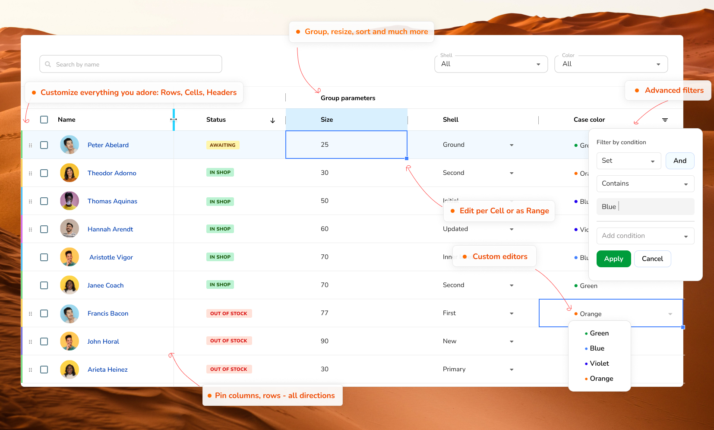
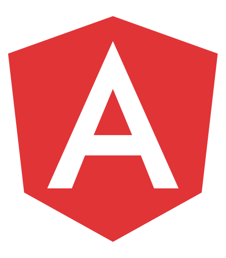

<p align="center">
  <a href="https://rv-grid.com">
    
  </a>
</p>

<p align="center">
  <a href="https://www.npmjs.com/package/@revolist/revogrid"></a>
  <a href="https://github.com/revolist/revogrid/blob/master/LICENSE"></a>
  
  
  
  
  <a href="https://github.com/revolist/revogrid/actions/workflows/unit.yml">
        
  </a>
  <a href="https://github.com/revolist/revogrid/actions/workflows/e2e.yml">
        
  </a>
</p>


<h3 align="center">Powerful data grid component built with <a href="https://stenciljs.com" target="_blank">StencilJS</a>.</h3>
<p align="center">
Render 1M+ rows, millions of cells, and thousands of columns efficiently with no hard row limit in the grid.
</p>
<p align="center">
Used by some of the largest companies in Europe and the United States.
</p>

<p align="center">
  <a href="https://rv-grid.com/demo/">Demo and API</a> •
  <a href="#key-features">Key Features</a> •
  <a href="#revogrid-pro-features">Pro Features</a> •
  <a href="#basic-usage">How To Use</a> •
  <a href="#installation">Installation</a> •
  <a href="https://rv-grid.com/guide/">Docs</a> •
  <a href="#license">License</a>
</p>


<i>RevoGrid material theme.</i>
<br>


## Key Features

- **High Performance**: Render 1M+ rows and millions of cells with no hard row limit in the grid. Virtualization keeps the DOM focused on the visible viewport.

- **[Accessibility](https://rv-grid.com/guide/wcag)**: Follows WAI-ARIA best practices.

- **[RTL Support](https://rv-grid.com/guide/rtl)**: Comprehensive Right-to-Left language support for Arabic, Hebrew, Persian, and other RTL languages. Features automatic column reordering, proper text alignment, and layout adjustments for RTL interfaces.

- **[Keyboard Support](https://rv-grid.com/guide/defs#Keyboard)**:
  - Excel-like focus for efficient navigation and editing.
  - Seamless copy/paste from Excel, Google Sheets, or any other sheet format.


- **Lightweight**: Minimal initial bundle size . Can be imported with polyfills or as a module for modern browsers.

- **[Intelligent Virtual DOM](https://rv-grid.com/guide/overview#VNode-Reactive-DOM)**: Smart row recombination to minimize redraws.

- **[Virtual Scroll](https://rv-grid.com/guide/viewports)**: Handles large datasets without rendering every row or column into the DOM.

- **[Drag and Drop](https://rv-grid.com/guide/row/order)**: Drag and drop in [rows](https://rv-grid.com/guide/row/order) and [columns](https://rv-grid.com/guide/column/order).

- **[Sorting](https://rv-grid.com/guide/sorting)**: Multiple options, customizable per column, with advanced event handling.

- **[Filtering](https://rv-grid.com/guide/filters)**:
  - Predefined system filters.
  - Multi column filters.
  - Conditional filters.
  - Preserve existing collections.
  - Selection.
  - Slider.
  - Header filtering.
  - Custom filters to extend system filters with your own set.

- **[Export](https://rv-grid.com/guide/export.plugin)**:
  - **[CSV](https://rv-grid.com/guide/export.plugin)**: Built-in file export for core RevoGrid data workflows.
  - **[PDF](https://rv-grid.com/guide/pdf-export)**: Browser-side PDF export with the lightweight [`@revolist/revogrid-pdf-export`](https://www.npmjs.com/package/@revolist/revogrid-pdf-export) plugin.
  - **[Excel (Pro)](https://rv-grid.com/guide/data-grid-export-excel)**: Workbook export for RevoGrid Pro with layout, styles, frozen panes, merged cells, and formulas.

- **Custom Sizes**: Define custom sizes for [columns](https://rv-grid.com/guide/column/#Column-Size) and [rows](https://rv-grid.com/guide/row/height). Automatic sizing based on content.

- **[Column Resizing](https://rv-grid.com/guide/column/resize)**: Adjust column widths.
- **Auto Size Columns**: Intelligent column width adjustment that automatically adapts to content, ensuring optimal readability and layout efficiency.

- **Pinned/Sticky/Freezed Elements**:
  - [Columns](https://rv-grid.com/guide/column/pin) (define left or right).
  - [Rows](https://rv-grid.com/guide/row/pin) (define top or bottom).

- **Grouping**:
  - [Column grouping](https://rv-grid.com/guide/column/grouping) (nested headers).
  - Column grouping Drill Down: Collapse grouping columns to streamline your grid view, trimming away unnecessary columns and enhancing data organization. Perfect for focusing on the information that matters most, while keeping your workspace clean and efficient.
  - [Row grouping](https://rv-grid.com/guide/row/grouping) (nested rows).

- **Column Types**: [More details](https://rv-grid.com/guide/column/#Column-Formats)
  - [Text/String](https://rv-grid.com/guide/column/types#String) (default).
  - [Number](https://rv-grid.com/guide/column/types#Number).
  - [Select/Dropdown](https://rv-grid.com/guide/column/types#Select-Dropdown).
  - [Date](https://rv-grid.com/guide/column/types#Date).
  - Custom (create extended styles using any template).

- **Range Operations**:
  - [Selection](https://rv-grid.com/guide/defs#Range).
  - [Editing](https://rv-grid.com/guide/defs#Range-Autofill).

- **[Theme Packages](https://rv-grid.com/guide/theme)**:
  - Excel-like (default).
  - Material (compact, dark, or light).

- **[Extensibility](https://rv-grid.com/guide/jsx.template)**: Modern VNode features and tsx support for easy extension.

- **[Trimmed Rows](https://rv-grid.com/guide/row/#Trimmed-Rows)**: Hide rows on demand.

- **[Plugin System](https://rv-grid.com/guide/plugin/)**: Create custom plugins or extend existing ones easily.

- **Customizations**:
  - [Column header template](https://rv-grid.com/guide/column/header.template).
  - [Row header template](https://rv-grid.com/guide/row/headers).
  - [Cell properties](https://rv-grid.com/guide/cell/) (define custom properties for rendered cells).
  - [Cell template](https://rv-grid.com/guide/cell/renderer) (create your own cell views).
  - [Cell editor](https://rv-grid.com/guide/cell/editor) (use predefined or apply your own custom editors and cell types).

- **[AI Agents and MCP](https://rv-grid.com/guide/mcp)**: Connect Codex, Cursor, Claude Code, and VS Code to version-aware RevoGrid docs, examples, migrations, feature availability, and typed API context.

- **Rich API & Additional Improvements**: Explore hundreds of other small customizations and improvements in [RevoGrid](https://rv-grid.com/).


## RevoGrid Pro Features

RevoGrid Pro extends the core grid with production plugins for advanced data entry, analytics, layout, validation, remote data workflows, and enterprise planning.

- **Advanced Data Structures**:
  - **Hierarchical Data View**: Display tree data with expandable rows, nested relationships, sorting, filtering, editing, and drag-and-drop friendly hierarchy handling.
  - **Row Transpose**: Flip records into a row-oriented view when users need to inspect one entity as a vertical form-like grid.

- **Headers, Columns, and Grid Structure**:
  - **Multi-Level Headers / Column Groups**: Build stacked, nested headers so related columns can sit under shared parent groups.
  - **Multi-Row Headers**: Render more than one header row for dense tables, grouped labels, or spreadsheet-like header layouts.
  - **Column Group Panel**: Let users drag columns into a grouping panel to create row groups interactively.
  - **Column Group Render Sync**: Keep grouped header rendering aligned during column moves, resizing, and virtualization updates.
  - **Column Move with Groups**: Move columns while preserving grouped header relationships and valid group boundaries.
  - **Column Collapse & Expand (Drill Down)**: Collapse grouped columns to focus on summary information, then expand when details are needed.
  - **Column Hide**: Hide and reveal columns to create focused views without mutating the underlying dataset.
  - **Column Add Popup**: Provide a UI flow for adding columns from available field definitions.
  - **Column Selection**: Select entire columns from the header for bulk operations, copying, formatting, or analysis.
  - **Column Stretch**: Distribute column widths to fill available grid space while respecting sizing constraints.
  - **Column Autosize**: Measure content and automatically adjust column widths for readability.
  - **Merge Cells**: Merge cells across rows and columns for grouped labels, reports, or spreadsheet-style layouts.
  - **Auto Merge / Same-Value Merge**: Automatically merge neighboring cells with matching values to reduce visual repetition.
  - **Sticky Cells and Rows**: Keep important rows, cells, totals, labels, or action areas visible while scrolling.
  - **Overlay Layers**: Push temporary UI layers above the grid for richer interactions without replacing the main grid.

- **Remote Data and Large Dataset Workflows**:
  - **Server Loading with Infinite Scroll**: Load remote data as users scroll, keeping memory and DOM usage controlled for large datasets.
  - **Infinite Scroll**: Support total-based or dynamic scrolling patterns where rows are fetched and released in chunks.
  - **Pagination**: Split large datasets into page-sized views with built-in navigation controls.
  - **Remote Pagination**: Keep page index, page size, total counts, and server-loaded rows synchronized with the grid.
  - **Server-Side Grouping**: Request grouped row blocks from a remote source, expand group paths on demand, and combine grouping with remote filtering, sorting, and export.

- **Data Management and Change Tracking**:
  - **Audit Trail History**: Record data-change history for traceability, review, and compliance-oriented workflows.
  - **History**: Track user edits and provide undo/redo controls for grid changes.
  - **History Controls**: Add ready-made UI controls for navigating undo and redo stacks.
  - **Range Apply Preview**: Preview copy, paste, or fill changes before applying them to target cells.
  - **Smart Auto Fill**: Fill ranges from an initial value, series, or pattern to speed repetitive data entry.
  - **Excel Export/Import**: Export and import Excel workbook formats including `xlsx`, `xlsm`, `xlsb`, and `xls`.
  - **Multi-Column Export Headers**: Preserve grouped and multi-level column headers when exporting structured grids.
  - **Clipboard with JSON**: Copy and paste structured JSON/object values while keeping control over parsing and rendering.

- **Selection and Range Operations**:
  - **Multi-Range Selection**: Work with multiple selected ranges for spreadsheet-style copy, edit, and interaction flows.
  - **Range Selection Limit**: Restrict selected ranges with configurable limits to protect performance and workflow rules.
  - **Row Checkbox Selection**: Select rows through checkbox controls with bulk selection and keyboard-friendly behavior.
  - **Row Advanced Drag and Drop**: Reorder rows with custom drag handles, multi-row behavior, and controlled drop handling.
  - **Row Expand**: Add expandable row affordances for detail views, children, or custom row content.
  - **Row Custom Heading**: Customize row header content for labels, actions, or contextual row information.

- **Filtering, Search, and Grouping**:
  - **Advanced Selection Filtering**: Filter with multi-condition selection controls for categorical data.
  - **Selection Filter Cascade**: Cascade filters so each choice narrows available values in dependent filters.
  - **Advanced Slider Filtering**: Filter numeric values with range sliders.
  - **Header Input Filtering**: Put filter inputs in the header area for fast per-column search.
  - **Date Filter**: Filter temporal data by date-specific conditions and ranges.
  - **Row Grouping Drag and Drop**: Drag fields into a panel to group rows dynamically.
  - **Grouping Aggregation**: Calculate grouped summaries such as sum, average, count, min, and max.
  - **Server-Side Group Aggregation**: Combine remote grouped data with aggregate values returned by the server.

- **Calculations and Formulas**:
  - **Formula Engine**: Add Excel-like formulas with cell references, dynamic calculations, and a broad function set.
  - **Formula Bar**: Give users a dedicated place to inspect and edit formulas.
  - **Formula Name Manager**: Define reusable named references for formulas.
  - **Formula Dependency Highlighting**: Highlight related cells so users can understand formula inputs and outputs.
  - **Summary Header**: Render calculated summary values in header-level UI.

- **Data Visualization and Cell Rendering**:
  - **Charts in Cells**: Render compact visuals such as progress lines, progress lines with values, sparklines, bar charts, timelines, rating stars, badges, change indicators, thumbs, and pie charts.
  - **Heat and Cold Maps**: Color-code values with gradients and legends so users can compare magnitude quickly.
  - **Conditional Formatting**: Apply styling rules based on cell values, row data, or custom logic.
  - **Multi-Cell Formatting**: Choose different renderers or editors inside the same column based on row-level conditions.
  - **Cell Flash**: Highlight recently changed values so live updates are easy to spot.
  - **Avatar, Badge, Progress, Rate, Link, and Chart Column Types**: Use ready-made renderers for common visual data patterns.
  - **Array Renderer**: Display array-like values inside cells with a purpose-built renderer.
  - **Buttons**: Add action buttons inside grid cells for row-level commands.

- **Editing and Data Entry**:
  - **Dynamic Form Editing**: Edit row data through a generated form with custom options and richer inputs.
  - **Full Row Editing**: Edit multiple columns in a row as one coordinated editing flow.
  - **Cell Checkbox Editors**: Use checkbox cells that act as both renderer and editor.
  - **Cell Slider Editor**: Edit bounded numeric values with an inline slider.
  - **Cell Counter Editor**: Adjust numeric values with plus/minus controls and configurable steps.
  - **Textarea Editor**: Edit longer text values without leaving the grid.
  - **Dropdown Editor**: Edit values through a dropdown or custom popup.
  - **Timeline Editor**: Edit date ranges and timeline-like values with visual controls.
  - **Cell Validation**: Highlight invalid cells and block or guide invalid edits with custom rules.
  - **Input Validation**: Validate editor input before it is committed to the grid.

- **User Interaction and UX**:
  - **Context Menus**: Build menus for cells, rows, columns, and headers with actions such as cut, copy, paste, insert, delete, and custom commands.
  - **Tooltips**: Show contextual information on hover for cells or custom grid elements.
  - **Next Line Focus (WCAG)**: Move focus automatically to the next row during data entry workflows.
  - **WCAG Helpers**: Improve keyboard and screen-reader-oriented grid workflows.
  - **Cell Focus Helpers**: Extend focus behavior for custom editing and navigation scenarios.
  - **Info Panel**: Show contextual status or helper information around grid interactions.
  - **Loader**: Display loading state while remote data, exports, or long-running operations are in progress.

- **Development and Integration**:
  - **Event Manager**: Coordinate grid events through one managed layer for easier customization and cleanup.
  - **Observable Props**: React to property changes and synchronize plugin state with grid configuration.
  - **Plugin Dependencies**: Declare and resolve plugin relationships when features need to work together.
  - **Dimension Animation**: Animate row and column dimension changes for smoother layout transitions.
  - **Dropdown Infrastructure**: Reuse popup/dropdown services for custom editors and plugin UI.
  - **Grid Presets and Utilities**: Compose reusable grid configurations, helper functions, and shared plugin behavior.

- **Enterprise Analytics and Planning**:
  - **Pivot Table**: Build multidimensional analytics with dynamic row, column, and value dimensions; built-in and custom aggregations; hierarchical rows; generated column groups; flat headers; grand totals and subtotals; values-on-rows layouts; row and column drill-down; grouped aggregate values; drag-and-drop configuration; compact field panel; server-side engine/store contracts; remote sorting and filtering; drilldown contracts; field registry validation; cache keys; serializable errors; and state save/load.
  - **Pivot Configurator**: Give users a drag-and-drop UI for choosing Pivot rows, columns, values, filters, and field layout.
  - **Gantt & Scheduling**: Plan projects with task, dependency, calendar, resource, assignment, and baseline models; summary tasks and milestones; WBS hierarchy; automatic scheduling; working calendars and holidays; constrained scheduling; dependency validation; FS, SS, FF, and SF dependencies with lead/lag; critical path and slack; baselines; resource filtering; task move, resize, create, and progress controls; indent/outdent; timeline zoom; highlighted ranges; non-working time shading; labels; and custom markers.
  - **Gantt Toolbar**: Provide ready-made timeline navigation, baseline, critical path, and export actions for Gantt views.
  - **Gantt Task Editor Dialog**: Edit task fields, dependencies, resources, and scheduling details in a structured dialog.

- **Advanced Support**:
  - **AI Agent Support**: Use Pro AI tooling to generate plugins, renderers, templates, and grid configurations.
  - **RevoGrid MCP - AI-Native Grid Intelligence**: Connect AI coding tools to version-aware docs, examples, migrations, feature resolution, and typed API context.
  - **Support via GitHub**: Get engineering support through GitHub-based workflows.
  - **Support via Email**: Get direct support for Pro and enterprise implementation questions.


<h2 align="center">Framework Friendly</h2>

<p align="center">

<p align="center">
<i>I am RevoGrid, your solution for efficiently representing large datasets <br /> in an "Excel-like" data table or as a list. Render native components inside each cell!</i>
</p>
</p>

<br>
<br>
<br>


## Installation

The library published as a [scoped NPM package](https://docs.npmjs.com/misc/scope) in the [NPMJS Revolist account](https://www.npmjs.com/org/revolist).
[Check for more info on our demo side](https://rv-grid.com/guide/installation).

With NPM:

```bash
npm i @revolist/revogrid --save;
```

With Yarn:

```bash
yarn add @revolist/revogrid;
```

## Browser Support

|  |  |  |  |  |
| ---------------------------------------------------------------------------------------- | ------------------------------------------------------------------------------------------- | ---------------------------------------------------------------------------------------- | ------------------------------------------------------------------------------------- | ---------------------------------------------------------------------------------- |
| Latest ✔   | Latest ✔ | Latest ✔ | Latest ✔ | Latest ✔ |
|

## Framework

In `<revo-grid />` we have developed a sophisticated Continuous Delivery (CD) system powered by GitHub Actions. This advanced system automatically builds and delivers grid versions across multiple frameworks, including React, Angular, Svelte, Vue 2, and Vue 3, with full type support. This ensures continuous version delivery, providing the latest grid enhancements and upgrades across all supported frameworks ✨. In the future (version 5), we are planning to switch to monorepo based development.


- [ Vue 3](https://rv-grid.com/guide/vue3/) and [Vue 2](https://rv-grid.com/guide/vue2/)
- [ React](https://rv-grid.com/guide/react/)
- [ Angular](https://rv-grid.com/guide/angular/)
- [ Svelte](https://rv-grid.com/guide/svelte/)
- [ JavaScript](https://rv-grid.com/guide/)

## Basic Usage

RevoGrid functions as a web component. Simply place the component on your page and access its properties as you would with any other HTML element. It also offers multiple ways to integrate our grid into your project:

- [Import the grid into your project](https://rv-grid.com/guide/installation)

### JavaScript Data Grid Simple Usage

```javascript
// Select the RevoGrid element from the DOM
const grid = document.querySelector('revo-grid');

// Define the columns for the grid
grid.columns = [{ prop: 'name', name: 'First Column' }, { prop: 'details' }];
// Define the data source for the grid
grid.source = [{ name: 'New Item', details: 'Item Description' }];
```

### Custom cell template

```javascript
// Select the RevoGrid element from the DOM
const grid = document.querySelector('revo-grid');

// Define the columns for the grid
grid.columns = [
  {
    prop: 'name',
    name: 'Custom cell template',
    // Custom cell template
    cellTemplate(h, { value }) {
      return h(
        'div',
        {
          style: { backgroundColor: 'red' }, // Styling the cell background
          class: { 'inner-cell': true }, // Adding a CSS class
        },
        value || '' // Display the cell content or an empty string if undefined
      );
    },
  },
];
// Define the data source for the grid
grid.source = [{ name: 'New Item' }];
```

[Example and guide](https://rv-grid.com/guide/)


- [ Vue 3](https://rv-grid.com/guide/vue3/) and [Vue 2](https://rv-grid.com/guide/vue2/)
- [ React](https://rv-grid.com/guide/react/)
- [ Angular](https://rv-grid.com/guide/angular/)
- [ Svelte](https://rv-grid.com/guide/svelte/)
- [ JavaScript](https://rv-grid.com/guide/)

## Versions

- **2.0+**: Introduced the plugin system, grouping, sorting, and filtering.
- **3.0+**: Breaking changes introduced:
    -   Removed the redundant viewport component.
    -   Renamed classes to support Bootstrap and other libraries:
        -   `row` -> `rgRow`
        -   `col` -> `rgCol`
        -   `data-cell` -> `rgCell`
        -   `data-header-cell` -> `rgHeaderCell`
    -   Migrated all method names to lowercase to align with modern event naming conventions. For example, `afterEdit` is now `afteredit`. Check the API for details.
    -   Added support for pure ESM modules to enable the use of the grid in all modern frontend tooling like Vite, Parcel, etc. You can now import custom elements without lazy loading. Note that you are responsible for polyfills.


- **4.0+**: Breaking changes introduced. See the [migration guide](https://rv-grid.com/guide/migration). 

-   Redesigned type support:
        - Removed deprecated namespaces:
            - **Before**: `RevoGrid.ColumnRegular`
            - **Now**: `ColumnRegular`;
        - Improved type import:
            - **Before**: `import { RevoGrid } from '@revolist/revogrid/dist/types/interfaces'`
            - **Now**: `import { ColumnRegular } from '@revolist/revogrid'`.
        - Changed viewport type names everywhere. For example, before: `rowDefinitions: [{ type: "row", index: 0, size: 145 }]`, after: `rowDefinitions: [{ type: "rgRow", index: 0, size: 145 }]`.
    -   Updated [event](https://rv-grid.com/guide/api/revoGrid.html#Events) naming convention. Review your [event](https://rv-grid.com/guide/api/revoGrid.html#Events) usage. [Event names](https://rv-grid.com/guide/api/revoGrid.html#Events) are all lowercase now and are aligned with modern event naming conventions. For example, `afterEdit` -> `afteredit`.
    - Multiple event breaking changes introduced: beforerowrender now returns `BeforeRowRenderEvent`. Check all events for details.

-   **Major improvements**:
    -   Rethought the entire framework approach. Introduced Pro version with advance support and pro features.
    -   Introduced slot support.
    -   Updated scrolling system for better mobile support.
    -   Advance template support. Introduced `additionalData` for templates and editors. `Prop` gives access to parent/root app context.
    -   Redesigned the documentation.
    -   Fixed major issues and significantly improved overall performance, making the grid multiple time faster.
    -   Enhanced plugin support - now with full access to grid providers.
    -   Updated documentation.
    -   Provided full framework support and native render for  Angular, React, Svelte and Vue.
 
-   **What next?**
    -   Check our [Roadmap](https://github.com/users/revolist/projects/3)


## Our Sponsors

We would like to extend our heartfelt gratitude to our sponsors for their generous support. Their contributions help us maintain and develop RevoGrid.

[](https://altruistiq.com)


### Become a Sponsor

If you or your company would like to support the ongoing development of RevoGrid, please consider [](https://opencollective.com/revogrid) or use a [Pro version](https://rv-grid.com/pro/). Your support will help us continue to improve the project and provide the best possible tool for the community.

Thank you for supporting RevoGrid! 🙏


## Testing

[](https://github.com/revolist/revogrid/actions/workflows/ci-unit.yml)
[](https://github.com/revolist/revogrid/actions/workflows/ci-e2e.yml)

RevoGrid is thoroughly tested to ensure reliability and stability.

| Suite | Command | Scope |
|---|---|---|
| Unit | `npm run test` | Services, utilities, pure logic |
| E2E (Playwright) | `npm run test:e2e` | Real browser rendering & interaction |

### E2E Tests

End-to-end tests use [@stencil/playwright](https://www.npmjs.com/package/@stencil/playwright) to run `<revo-grid>` in a real Chromium browser. The dev server starts automatically when you run:

```bash
npm run test:e2e
```

Test files live in `e2e/` and share helpers from `e2e/helpers.ts`:

### Local startup troubleshooting

For targeted local work, confirm a new or changed test is discoverable before starting the dev server:

```bash
./node_modules/.bin/playwright test e2e/pinning.spec.ts --grep "test name" --list
```

Then run a non-watch Stencil build to catch compile errors without invoking the Playwright web-server lifecycle:

```bash
./node_modules/.bin/stencil build --dev --serve --no-open
```

If Playwright fails before any tests run with a Stencil dev-server startup error such as `ERR_SOCKET_BAD_PORT` and port `65536`, treat it as an environment/startup issue rather than an e2e assertion failure. Check `node -v` and whether another local server is already using `localhost:3333`, then retry only after changing that environment state.


## Contributing

By getting involved, you'll have the opportunity to enhance your skills, gain valuable experience, and make a significant impact on an innovative project. Your contribution, no matter how big or small, is valuable.

### Why Contribute?

- **Expand Your Knowledge**: Working on complex libraries allows you to dive deep into modern web technologies, improve your coding skills, and learn best practices in performance optimization, data handling, and component-based architecture.
- **Experience**: Contributing to an open-source project like provides you with practical experience that can be a great addition to your portfolio. It demonstrates your ability to work collaboratively, solve complex problems, and contribute to a project's success.
- **Professional Growth**: By contributing, you become part of a network of talented developers. This can lead to mentorship opportunities, collaborations, and professional connections that can benefit your career. 


## License

MIT

---

