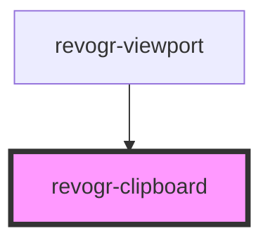

# revogr-clipboard

<!-- Auto Generated Below -->

## Methods

### `copy() => Promise<void>`

#### Returns

Type: `Promise<void>`

### `paste() => Promise<void>`

#### Returns

Type: `Promise<void>`

## Dependencies

### Used by

 - [revogr-viewport](../viewport)

### Graph

----------------------------------------------

*Built with [StencilJS](https://stenciljs.com/)*
