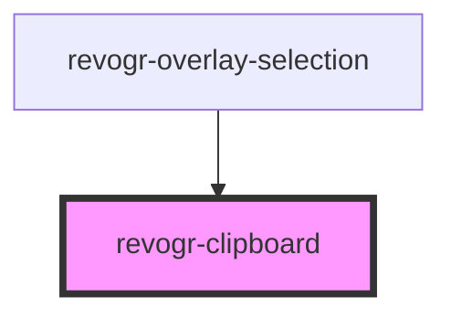

# revogr-clipboard

<!-- Auto Generated Below -->

## Events

| Event         | Description | Type                        |
| ------------- | ----------- | --------------------------- |
| `copyRegion`  |             | `CustomEvent<DataTransfer>` |
| `pasteRegion` |             | `CustomEvent<string[][]>`   |

## Methods

### `doCopy(e: DataTransfer, data?: RevoGrid.DataFormat[][]) => Promise<void>`

#### Returns

Type: `Promise<void>`

## Dependencies

### Used by

 - [revogr-overlay-selection](../overlay)

### Graph

----------------------------------------------

*Built with [StencilJS](https://stenciljs.com/)*
