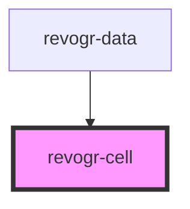

# revogr-cell

<!-- Auto Generated Below -->

## Overview

Component is responsible for rendering cell
Main purpose is to track changes and understand what exactly need to be rerendered instead of full grid render

## Properties

| Property                     | Attribute         | Description                                                                                               | Type                                                                                                                                                                                                                                          | Default     |
| ---------------------------- | ----------------- | --------------------------------------------------------------------------------------------------------- | --------------------------------------------------------------------------------------------------------------------------------------------------------------------------------------------------------------------------------------------- | ----------- |
| `additionalData`             | `additional-data` | Additional data to pass to renderer Used in plugins such as vue or react to pass root app entity to cells | `any`                                                                                                                                                                                                                                         | `undefined` |
| `colEnd` _(required)_        | `col-end`         | Right side edge position in px                                                                            | `number`                                                                                                                                                                                                                                      | `undefined` |
| `colIndex` _(required)_      | `col-index`       | Column index                                                                                              | `number`                                                                                                                                                                                                                                      | `undefined` |
| `colSize` _(required)_       | `col-size`        | Column width                                                                                              | `number`                                                                                                                                                                                                                                      | `undefined` |
| `colStart` _(required)_      | `col-start`       | Left side edge position in px                                                                             | `number`                                                                                                                                                                                                                                      | `undefined` |
| `columnService` _(required)_ | --                | Column service                                                                                            | `ColumnService`                                                                                                                                                                                                                               | `undefined` |
| `depth`                      | `depth`           | Grouping depth                                                                                            | `number`                                                                                                                                                                                                                                      | `undefined` |
| `providers` _(required)_     | --                | Cached providers                                                                                          | `{ type: DimensionRows; readonly: boolean; data: Observable<DataSourceState<any, any>> \| ColumnRegular[]; viewport: Observable<ViewportState>; dimension: Observable<DimensionSettingsState>; selection: Observable<SelectionStoreState>; }` | `undefined` |
| `rowEnd` _(required)_        | `row-end`         | Bottom cell side edge position in px                                                                      | `number`                                                                                                                                                                                                                                      | `undefined` |
| `rowIndex` _(required)_      | `row-index`       | Row index viewport Y position                                                                             | `number`                                                                                                                                                                                                                                      | `undefined` |
| `rowSize` _(required)_       | `row-size`        | Row height in px                                                                                          | `number`                                                                                                                                                                                                                                      | `undefined` |
| `rowStart` _(required)_      | `row-start`       | Top cell side edge position in px                                                                         | `number`                                                                                                                                                                                                                                      | `undefined` |

## Events

| Event              | Description                                                          | Type                                                                        |
| ------------------ | -------------------------------------------------------------------- | --------------------------------------------------------------------------- |
| `beforecellrender` | Before each cell render function. Allows to override cell properties | `CustomEvent<BeforeCellRenderEvent<any>>`                                   |
| `dragstartcell`    | Event emitted on cell drag start                                     | `CustomEvent<{ originalEvent: MouseEvent; model: ColumnDataSchemaModel; }>` |

## Dependencies

### Used by

 - [revogr-data](../data)

### Graph

----------------------------------------------

*Built with love by Revolist OU*
