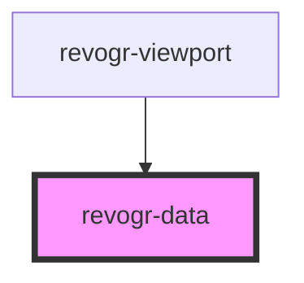

# viewport-data-component

<!-- Auto Generated Below -->

## Properties

| Property            | Attribute   | Description                                                     | Type                                                           | Default     |
| ------------------- | ----------- | --------------------------------------------------------------- | -------------------------------------------------------------- | ----------- |
| `canDrag`           | `can-drag`  |                                                                 | `boolean`                                                      | `undefined` |
| `colData`           | --          | Static stores, not expected to change during component lifetime | `ObservableMap<DataSourceState<ColumnRegular, DimensionCols>>` | `undefined` |
| `dataStore`         | --          |                                                                 | `ObservableMap<DataSourceState<DataType, DimensionRows>>`      | `undefined` |
| `dimensionRow`      | --          |                                                                 | `ObservableMap<DimensionSettingsState>`                        | `undefined` |
| `range`             | `range`     |                                                                 | `boolean`                                                      | `undefined` |
| `readonly`          | `readonly`  |                                                                 | `boolean`                                                      | `undefined` |
| `rowClass`          | `row-class` |                                                                 | `string`                                                       | `undefined` |
| `rowSelectionStore` | --          |                                                                 | `ObservableMap<SelectionStoreState>`                           | `undefined` |
| `viewportCol`       | --          |                                                                 | `ObservableMap<ViewportState>`                                 | `undefined` |
| `viewportRow`       | --          |                                                                 | `ObservableMap<ViewportState>`                                 | `undefined` |

## Events

| Event           | Description | Type                      |
| --------------- | ----------- | ------------------------- |
| `dragStartCell` |             | `CustomEvent<MouseEvent>` |

## Dependencies

### Used by

- [revogr-viewport](../viewport)

### Graph

---

_Built with [StencilJS](https://stenciljs.com/)_
