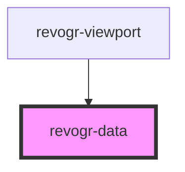

# viewport-data-component

<!-- Auto Generated Below -->

## Properties

| Property       | Attribute  | Description                                                     | Type                                       | Default     |
| -------------- | ---------- | --------------------------------------------------------------- | ------------------------------------------ | ----------- |
| `canDrag`      | `can-drag` |                                                                 | `boolean`                                  | `undefined` |
| `colData`      | --         |                                                                 | `ColumnDataSchemaRegular[]`                | `undefined` |
| `cols`         | --         |                                                                 | `VirtualPositionItem[]`                    | `undefined` |
| `dataStore`    | --         | Static stores, not expected to change during component lifetime | `ObservableMap<DataSourceState<DataType>>` | `undefined` |
| `dimensionRow` | --         |                                                                 | `ObservableMap<DimensionSettingsState>`    | `undefined` |
| `range`        | `range`    |                                                                 | `boolean`                                  | `undefined` |
| `readonly`     | `readonly` |                                                                 | `boolean`                                  | `undefined` |
| `rows`         | --         |                                                                 | `VirtualPositionItem[]`                    | `undefined` |

## Events

| Event           | Description | Type                      |
| --------------- | ----------- | ------------------------- |
| `dragStartCell` |             | `CustomEvent<MouseEvent>` |

## Dependencies

### Used by

 - [revogr-viewport](../viewport)

### Graph

----------------------------------------------

*Built with [StencilJS](https://stenciljs.com/)*
