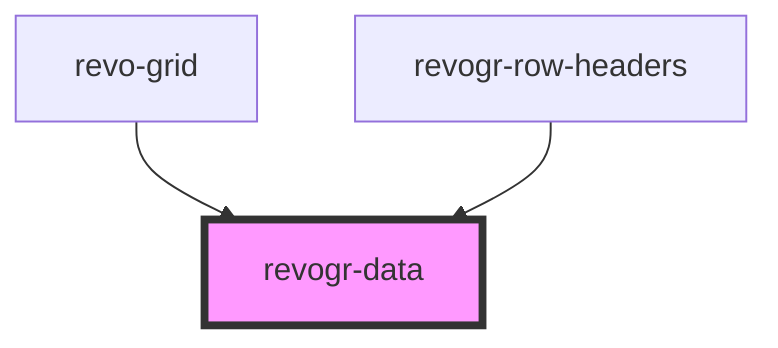

# viewport-data-component

<!-- Auto Generated Below -->

## Overview

This component is responsible for rendering data
Rows, columns, groups and cells

## Properties

| Property                         | Attribute         | Description                                                     | Type                                                           | Default     |
| -------------------------------- | ----------------- | --------------------------------------------------------------- | -------------------------------------------------------------- | ----------- |
| `additionalData`                 | `additional-data` | Additional data to pass to renderer                             | `any`                                                          | `undefined` |
| `colData` _(required)_           | --                | Static stores, not expected to change during component lifetime | `ObservableMap<DataSourceState<ColumnRegular, DimensionCols>>` | `undefined` |
| `dataStore` _(required)_         | --                |                                                                 | `ObservableMap<DataSourceState<DataType, DimensionRows>>`      | `undefined` |
| `dimensionRow` _(required)_      | --                |                                                                 | `ObservableMap<DimensionSettingsState>`                        | `undefined` |
| `range`                          | `range`           | Range selection mode                                            | `boolean`                                                      | `undefined` |
| `readonly`                       | `readonly`        | If readonly mode enables                                        | `boolean`                                                      | `undefined` |
| `rowClass`                       | `row-class`       | Defines property from which to read row class                   | `string`                                                       | `undefined` |
| `rowSelectionStore` _(required)_ | --                |                                                                 | `ObservableMap<SelectionStoreState>`                           | `undefined` |
| `type` _(required)_              | `type`            |                                                                 | `"rgRow" \| "rowPinEnd" \| "rowPinStart"`                      | `undefined` |
| `viewportCol` _(required)_       | --                |                                                                 | `ObservableMap<ViewportState>`                                 | `undefined` |
| `viewportRow` _(required)_       | --                |                                                                 | `ObservableMap<ViewportState>`                                 | `undefined` |

## Events

| Event                | Description | Type                                                                        |
| -------------------- | ----------- | --------------------------------------------------------------------------- |
| `afterrender`        |             | `CustomEvent<any>`                                                          |
| `before-cell-render` |             | `CustomEvent<BeforeCellRenderEvent>`                                        |
| `beforeRowRender`    |             | `CustomEvent<any>`                                                          |
| `dragStartCell`      |             | `CustomEvent<{ originalEvent: MouseEvent; model: ColumnDataSchemaModel; }>` |

## Dependencies

### Used by

 - [revo-grid](../revoGrid)
 - [revogr-row-headers](../rowHeaders)

### Graph

----------------------------------------------

*Built with [StencilJS](https://stenciljs.com/)*
