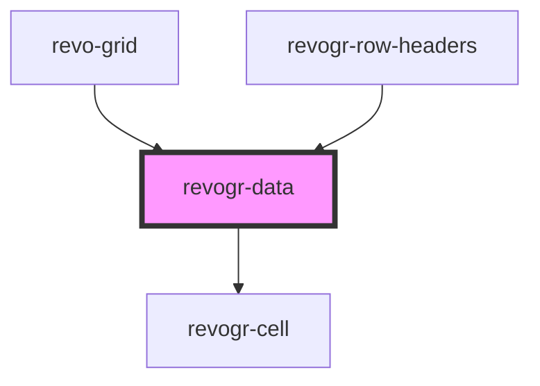

# viewport-data-component

<!-- Auto Generated Below -->

## Overview

This component is responsible for rendering data
Rows, columns, groups and cells

## Properties

| Property                         | Attribute         | Description                                                                                               | Type                                                        | Default     |
| -------------------------------- | ----------------- | --------------------------------------------------------------------------------------------------------- | ----------------------------------------------------------- | ----------- |
| `additionalData`                 | `additional-data` | Additional data to pass to renderer Used in plugins such as vue or react to pass root app entity to cells | `any`                                                       | `undefined` |
| `colData`                        | --                | Column source                                                                                             | `ObservableMap<DSourceState<ColumnRegular, DimensionCols>>` | `undefined` |
| `dataStore` _(required)_         | --                | Data rows source                                                                                          | `ObservableMap<DSourceState<DataType, DimensionRows>>`      | `undefined` |
| `dimensionRow` _(required)_      | --                | Dimension settings Y                                                                                      | `ObservableMap<DimensionSettingsState>`                     | `undefined` |
| `range`                          | `range`           | Range allowed                                                                                             | `boolean`                                                   | `undefined` |
| `readonly`                       | `readonly`        | Readonly mode                                                                                             | `boolean`                                                   | `undefined` |
| `rowClass`                       | `row-class`       | Defines property from which to read row class                                                             | `string`                                                    | `undefined` |
| `rowSelectionStore` _(required)_ | --                | Selection, range, focus for row selection                                                                 | `ObservableMap<SelectionStoreState>`                        | `undefined` |
| `type` _(required)_              | `type`            | Data type                                                                                                 | `"rgRow" \| "rowPinEnd" \| "rowPinStart"`                   | `undefined` |
| `viewportCol` _(required)_       | --                | Viewport X                                                                                                | `ObservableMap<ViewportState>`                              | `undefined` |
| `viewportRow` _(required)_       | --                | Viewport Y                                                                                                | `ObservableMap<ViewportState>`                              | `undefined` |

## Events

| Event             | Description                                       | Type                                     |
| ----------------- | ------------------------------------------------- | ---------------------------------------- |
| `afterrender`     | When data render finished for the designated type | `CustomEvent<any>`                       |
| `beforerowrender` | Before each row render                            | `CustomEvent<BeforeRowRenderEvent<any>>` |

## Dependencies

### Used by

 - [revo-grid](../revoGrid)
 - [revogr-row-headers](../rowHeaders)

### Depends on

- [revogr-cell](../data-cell)

### Graph

----------------------------------------------

*Built with love by Revolist OU*
