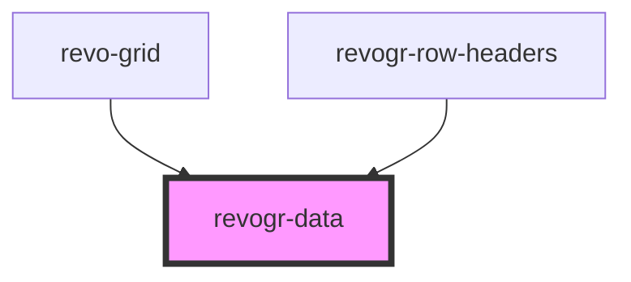

# viewport-data-component

<!-- Auto Generated Below -->

## Properties

| Property                         | Attribute   | Description                                                     | Type                                                           | Default     |
| -------------------------------- | ----------- | --------------------------------------------------------------- | -------------------------------------------------------------- | ----------- |
| `colData` _(required)_           | --          | Static stores, not expected to change during component lifetime | `ObservableMap<DataSourceState<ColumnRegular, DimensionCols>>` | `undefined` |
| `dataStore` _(required)_         | --          |                                                                 | `ObservableMap<DataSourceState<DataType, DimensionRows>>`      | `undefined` |
| `dimensionRow` _(required)_      | --          |                                                                 | `ObservableMap<DimensionSettingsState>`                        | `undefined` |
| `range`                          | `range`     |                                                                 | `boolean`                                                      | `undefined` |
| `readonly`                       | `readonly`  |                                                                 | `boolean`                                                      | `undefined` |
| `rowClass`                       | `row-class` |                                                                 | `string`                                                       | `undefined` |
| `rowSelectionStore` _(required)_ | --          |                                                                 | `ObservableMap<SelectionStoreState>`                           | `undefined` |
| `type` _(required)_              | `type`      |                                                                 | `string`                                                       | `undefined` |
| `viewportCol` _(required)_       | --          |                                                                 | `ObservableMap<ViewportState>`                                 | `undefined` |
| `viewportRow` _(required)_       | --          |                                                                 | `ObservableMap<ViewportState>`                                 | `undefined` |

## Events

| Event           | Description | Type                      |
| --------------- | ----------- | ------------------------- |
| `dragStartCell` |             | `CustomEvent<MouseEvent>` |

## Dependencies

### Used by

 - [revo-grid](../revoGrid)
 - [revogr-row-headers](../rowHeaders)

### Graph

----------------------------------------------

*Built with [StencilJS](https://stenciljs.com/)*
