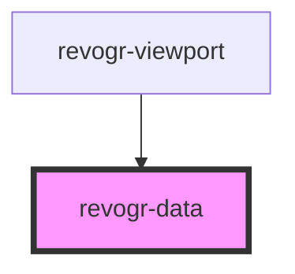

# viewport-data-component

<!-- Auto Generated Below -->

## Properties

| Property    | Attribute  | Description | Type                                       | Default     |
| ----------- | ---------- | ----------- | ------------------------------------------ | ----------- |
| `colData`   | --         |             | `ColumnDataSchemaRegular[]`                | `undefined` |
| `cols`      | --         |             | `VirtualPositionItem[]`                    | `undefined` |
| `dataStore` | --         |             | `ObservableMap<DataSourceState<DataType>>` | `undefined` |
| `range`     | `range`    |             | `boolean`                                  | `undefined` |
| `readonly`  | `readonly` |             | `boolean`                                  | `undefined` |
| `rows`      | --         |             | `VirtualPositionItem[]`                    | `undefined` |

## Dependencies

### Used by

 - [revogr-viewport](../viewport)

### Graph

----------------------------------------------

*Built with [StencilJS](https://stenciljs.com/)*
