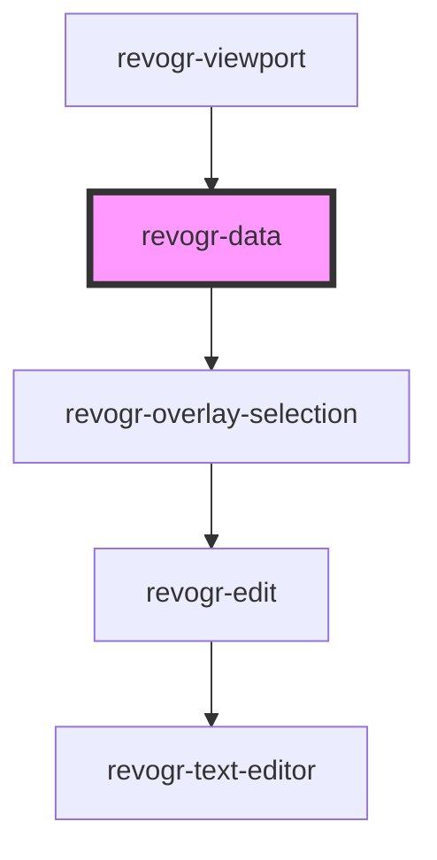

# viewport-data-component

<!-- Auto Generated Below -->

## Properties

| Property                  | Attribute  | Description | Type                                       | Default     |
| ------------------------- | ---------- | ----------- | ------------------------------------------ | ----------- |
| `colData`                 | --         |             | `ColumnDataSchemaRegular[]`                | `undefined` |
| `cols`                    | --         |             | `VirtualPositionItem[]`                    | `undefined` |
| `dataStore`               | --         |             | `ObservableMap<DataSourceState<DataType>>` | `undefined` |
| `dimensionCol`            | --         |             | `ObservableMap<DimensionSettingsState>`    | `undefined` |
| `dimensionRow`            | --         |             | `ObservableMap<DimensionSettingsState>`    | `undefined` |
| `lastCell`                | --         |             | `Cell`                                     | `undefined` |
| `position`                | --         |             | `Cell`                                     | `undefined` |
| `range`                   | `range`    |             | `boolean`                                  | `undefined` |
| `readonly`                | `readonly` |             | `boolean`                                  | `undefined` |
| `rows`                    | --         |             | `VirtualPositionItem[]`                    | `undefined` |
| `selectionStoreConnector` | --         |             | `SelectionStoreConnectorI`                 | `undefined` |
| `uuid`                    | `uuid`     |             | `string`                                   | `''`        |

## Events

| Event        | Description | Type                                                               |
| ------------ | ----------- | ------------------------------------------------------------------ |
| `afterEdit`  |             | `CustomEvent<{ model: DataType; prop: ColumnProp; val: string; }>` |
| `beforeEdit` |             | `CustomEvent<{ model: DataType; prop: ColumnProp; val: string; }>` |

## Dependencies

### Used by

 - [revogr-viewport](../viewport)

### Depends on

- [revogr-overlay-selection](../overlay/selection)

### Graph

----------------------------------------------

*Built with [StencilJS](https://stenciljs.com/)*
