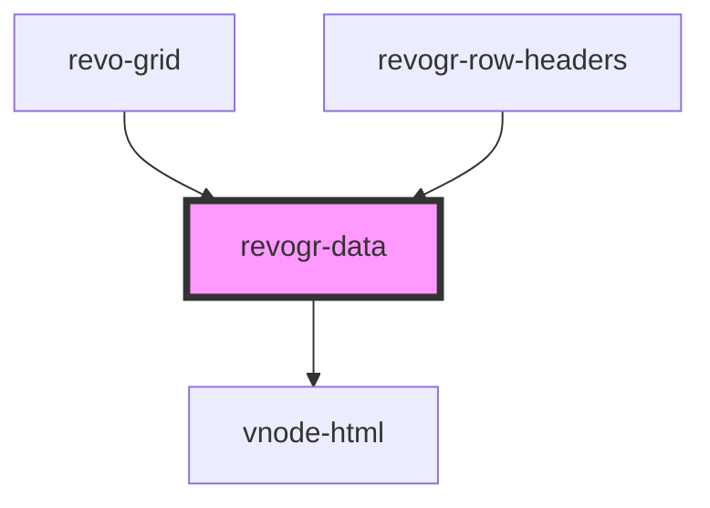

# viewport-data-component

<!-- Auto Generated Below -->

## Overview

This component is responsible for rendering data
Rows, columns, groups and cells

## Properties

| Property                         | Attribute         | Description                                                                                                                                                                                | Type                                                        | Default     |
| -------------------------------- | ----------------- | ------------------------------------------------------------------------------------------------------------------------------------------------------------------------------------------ | ----------------------------------------------------------- | ----------- |
| `additionalData`                 | `additional-data` | Additional data to pass to renderer Used in plugins such as vue or react to pass root app entity to cells                                                                                  | `any`                                                       | `undefined` |
| `colData`                        | --                | Column source                                                                                                                                                                              | `ObservableMap<DSourceState<ColumnRegular, DimensionCols>>` | `undefined` |
| `colType` _(required)_           | `col-type`        | Column data type                                                                                                                                                                           | `"colPinEnd" \| "colPinStart" \| "rgCol" \| "rowHeaders"`   | `undefined` |
| `dataStore` _(required)_         | --                | Data rows source                                                                                                                                                                           | `ObservableMap<DSourceState<DataType, DimensionRows>>`      | `undefined` |
| `dimensionRow` _(required)_      | --                | Dimension settings Y                                                                                                                                                                       | `ObservableMap<DimensionSettingsState>`                     | `undefined` |
| `jobsBeforeRender`               | --                | Prevent rendering until job is done. Can be used for initial rendering performance improvement. When several plugins require initial rendering this will prevent double initial rendering. | `Promise<any>[]`                                            | `[]`        |
| `range`                          | `range`           | Range allowed                                                                                                                                                                              | `boolean`                                                   | `undefined` |
| `readonly`                       | `readonly`        | Readonly mode                                                                                                                                                                              | `boolean`                                                   | `undefined` |
| `rowClass`                       | `row-class`       | Defines property from which to read row class                                                                                                                                              | `string`                                                    | `undefined` |
| `rowSelectionStore` _(required)_ | --                | Selection, range, focus for row selection                                                                                                                                                  | `ObservableMap<SelectionStoreState>`                        | `undefined` |
| `type` _(required)_              | `type`            | Row data type                                                                                                                                                                              | `"rgRow" \| "rowPinEnd" \| "rowPinStart"`                   | `undefined` |
| `viewportCol` _(required)_       | --                | Viewport X                                                                                                                                                                                 | `ObservableMap<ViewportState>`                              | `undefined` |
| `viewportRow` _(required)_       | --                | Viewport Y                                                                                                                                                                                 | `ObservableMap<ViewportState>`                              | `undefined` |

## Events

| Event              | Description                                                          | Type                                                                        |
| ------------------ | -------------------------------------------------------------------- | --------------------------------------------------------------------------- |
| `afterrender`      | When data render finished for the designated type                    | `CustomEvent<{ type: DimensionRows; }>`                                     |
| `beforecellrender` | Before each cell render function. Allows to override cell properties | `CustomEvent<BeforeCellRenderEvent<any>>`                                   |
| `beforerowrender`  | Before each row render                                               | `CustomEvent<BeforeRowRenderEvent<any>>`                                    |
| `dragstartcell`    | Event emitted on cell drag start                                     | `CustomEvent<{ originalEvent: MouseEvent; model: ColumnDataSchemaModel; }>` |

## Methods

### `updateCell(e: { row: number; col: number; }) => Promise<void>`

Pointed cell update.

#### Parameters

| Name | Type                            | Description |
| ---- | ------------------------------- | ----------- |
| `e`  | `{ row: number; col: number; }` |             |

#### Returns

Type: `Promise<void>`

## Dependencies

### Used by

 - [revo-grid](../revoGrid)
 - [revogr-row-headers](../rowHeaders)

### Depends on

- [vnode-html](../vnode)

### Graph

----------------------------------------------

*Built with love by Revolist OU*
