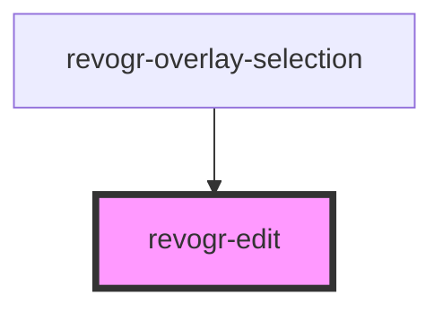

# revogr-edit

<!-- Auto Generated Below -->

## Overview

Represents a cell editor in a grid.
It manages the editing of cells by handling events, saving data, rendering the editor UI,
and managing the lifecycle of the editor instance.

## Properties

| Property         | Attribute         | Description                                                            | Type                                    | Default     |
| ---------------- | ----------------- | ---------------------------------------------------------------------- | --------------------------------------- | ----------- |
| `additionalData` | `additional-data` | Additional data to pass to renderer                                    | `any`                                   | `undefined` |
| `column`         | --                | Column data for editor.                                                | `ColumnRegular`                         | `undefined` |
| `editCell`       | --                | Cell to edit data.                                                     | `EditCellStore & BeforeSaveDataDetails` | `undefined` |
| `editor`         | --                | Custom editors register                                                | `EditorCtr`                             | `undefined` |
| `saveOnClose`    | `save-on-close`   | Save on editor close. Defines if data should be saved on editor close. | `boolean`                               | `false`     |

## Events

| Event       | Description                                         | Type                                                                                                                      |
| ----------- | --------------------------------------------------- | ------------------------------------------------------------------------------------------------------------------------- |
| `celledit`  | Cell edit event                                     | `CustomEvent<{ rgRow: number; rgCol: number; type: DimensionRows; prop: ColumnProp; val: any; preventFocus?: boolean; }>` |
| `closeedit` | Close editor event pass true if requires focus next | `CustomEvent<boolean>`                                                                                                    |

## Methods

### `beforeDisconnect() => Promise<void>`

Before editor got disconnected.
Can be triggered multiple times before actual disconnect.

#### Returns

Type: `Promise<void>`

### `cancelChanges() => Promise<void>`

Cancel pending changes flag. Editor will be closed without autosave.

#### Returns

Type: `Promise<void>`

## Dependencies

### Used by

 - [revogr-overlay-selection](../overlay)

### Graph

----------------------------------------------

*Built with love by Revolist OU*
