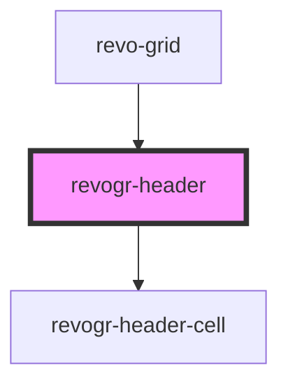

# viewport-header-data-component

<!-- Auto Generated Below -->

## Dependencies

### Used by

 - [revo-grid](../revo-grid)

### Depends on

- [revogr-header-cell](../header-cell)

### Graph

----------------------------------------------

*Built with [StencilJS](https://stenciljs.com/)*
