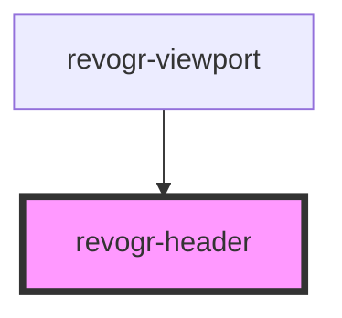

# viewport-header-data-component

<!-- Auto Generated Below -->

## Properties

| Property        | Attribute        | Description | Type                                    | Default     |
| --------------- | ---------------- | ----------- | --------------------------------------- | ----------- |
| `canResize`     | `can-resize`     |             | `boolean`                               | `undefined` |
| `colData`       | --               |             | `ColumnRegular[]`                       | `undefined` |
| `cols`          | --               |             | `VirtualPositionItem[]`                 | `undefined` |
| `dimensionCol`  | --               |             | `ObservableMap<DimensionSettingsState>` | `undefined` |
| `groupingDepth` | `grouping-depth` |             | `number`                                | `0`         |
| `groups`        | --               |             | `{ [level: number]: Group[]; }`         | `undefined` |
| `parent`        | `parent`         |             | `string`                                | `''`        |

## Events

| Event          | Description | Type                                        |
| -------------- | ----------- | ------------------------------------------- |
| `headerClick`  |             | `CustomEvent<ColumnRegular>`                |
| `headerResize` |             | `CustomEvent<{ [index: string]: number; }>` |

## Dependencies

### Used by

 - [revogr-viewport](../viewport)

### Graph

----------------------------------------------

*Built with [StencilJS](https://stenciljs.com/)*
