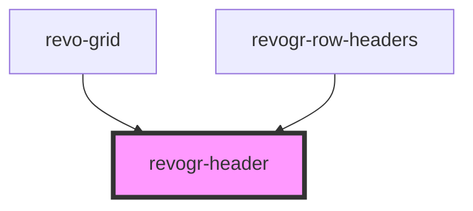

# viewport-header-data-component

<!-- Auto Generated Below -->

## Properties

| Property            | Attribute         | Description                                                                                     | Type                                                           | Default     |
| ------------------- | ----------------- | ----------------------------------------------------------------------------------------------- | -------------------------------------------------------------- | ----------- |
| `additionalData`    | `additional-data` | Extra properties to pass into header renderer, such as vue or react components to handle parent | `any`                                                          | `{}`        |
| `canResize`         | `can-resize`      | If columns can be resized                                                                       | `boolean`                                                      | `undefined` |
| `colData`           | --                | Columns - defines an array of grid columns.                                                     | `ColumnRegular[]`                                              | `undefined` |
| `columnFilter`      | `column-filter`   | Column filter                                                                                   | `boolean`                                                      | `undefined` |
| `dimensionCol`      | --                |                                                                                                 | `ObservableMap<DimensionSettingsState>`                        | `undefined` |
| `groupingDepth`     | `grouping-depth`  |                                                                                                 | `number`                                                       | `0`         |
| `groups`            | --                |                                                                                                 | `{ [x: string]: any; }`                                        | `undefined` |
| `parent`            | `parent`          |                                                                                                 | `string`                                                       | `''`        |
| `readonly`          | `readonly`        | Readonly mode                                                                                   | `boolean`                                                      | `undefined` |
| `resizeHandler`     | --                | Defines resize position                                                                         | `("b" \| "rt" \| "lt" \| "r" \| "rb" \| "lb" \| "l" \| "t")[]` | `undefined` |
| `selectionStore`    | --                |                                                                                                 | `ObservableMap<SelectionStoreState>`                           | `undefined` |
| `type` _(required)_ | `type`            | Column type                                                                                     | `"colPinEnd" \| "colPinStart" \| "rgCol" \| "rowHeaders"`      | `undefined` |
| `viewportCol`       | --                | Stores                                                                                          | `ObservableMap<ViewportState>`                                 | `undefined` |

## Events

| Event                | Description | Type                                                                                |
| -------------------- | ----------- | ----------------------------------------------------------------------------------- |
| `before-resize`      |             | `CustomEvent<ColumnRegular[]>`                                                      |
| `headerdblClick`     |             | `CustomEvent<{ index: number; originalEvent: MouseEvent; column: ColumnRegular; }>` |
| `headerresize`       |             | `CustomEvent<{ [x: string]: number; }>`                                             |
| `initialHeaderClick` |             | `CustomEvent<{ index: number; originalEvent: MouseEvent; column: ColumnRegular; }>` |

## Dependencies

### Used by

 - [revo-grid](../revoGrid)
 - [revogr-row-headers](../rowHeaders)

### Graph

----------------------------------------------

*Built with [StencilJS](https://stenciljs.com/)*
