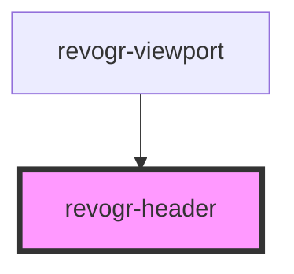

# viewport-header-data-component

<!-- Auto Generated Below -->

## Properties

| Property         | Attribute        | Description | Type                                    | Default     |
| ---------------- | ---------------- | ----------- | --------------------------------------- | ----------- |
| `canResize`      | `can-resize`     |             | `boolean`                               | `undefined` |
| `colData`        | --               |             | `ColumnRegular[]`                       | `undefined` |
| `dimensionCol`   | --               |             | `ObservableMap<DimensionSettingsState>` | `undefined` |
| `groupingDepth`  | `grouping-depth` |             | `number`                                | `0`         |
| `groups`         | --               |             | `{ [level: number]: Group[]; }`         | `undefined` |
| `parent`         | `parent`         |             | `string`                                | `''`        |
| `selectionStore` | --               |             | `ObservableMap<SelectionStoreState>`    | `undefined` |
| `viewportCol`    | --               |             | `ObservableMap<ViewportState>`          | `undefined` |

## Events

| Event                | Description | Type                                                     |
| -------------------- | ----------- | -------------------------------------------------------- |
| `headerDblClick`     |             | `CustomEvent<{ column: ColumnRegular; index: number; }>` |
| `headerResize`       |             | `CustomEvent<{ [x: string]: number; }>`                  |
| `initialHeaderClick` |             | `CustomEvent<{ column: ColumnRegular; index: number; }>` |

## Dependencies

### Used by

 - [revogr-viewport](../viewport)

### Graph

----------------------------------------------

*Built with [StencilJS](https://stenciljs.com/)*
