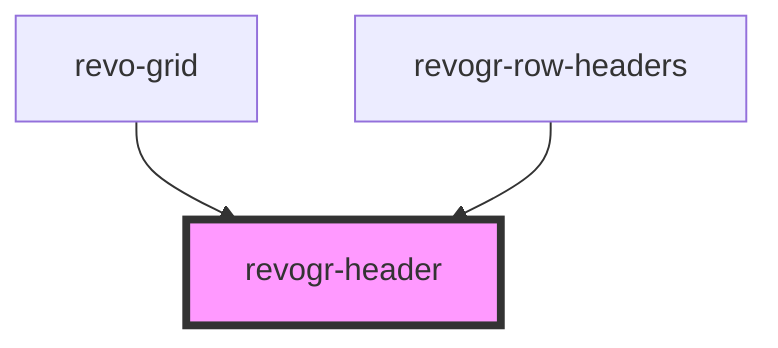

# viewport-header-data-component

<!-- Auto Generated Below -->

## Properties

| Property            | Attribute        | Description | Type                                    | Default     |
| ------------------- | ---------------- | ----------- | --------------------------------------- | ----------- |
| `canResize`         | `can-resize`     |             | `boolean`                               | `undefined` |
| `colData`           | --               |             | `ColumnRegular[]`                       | `undefined` |
| `columnFilter`      | `column-filter`  |             | `boolean`                               | `undefined` |
| `dimensionCol`      | --               |             | `ObservableMap<DimensionSettingsState>` | `undefined` |
| `groupingDepth`     | `grouping-depth` |             | `number`                                | `0`         |
| `groups`            | --               |             | `{ [x: string]: any; }`                 | `undefined` |
| `parent`            | `parent`         |             | `string`                                | `''`        |
| `selectionStore`    | --               |             | `ObservableMap<SelectionStoreState>`    | `undefined` |
| `type` _(required)_ | `type`           |             | `string`                                | `undefined` |
| `viewportCol`       | --               |             | `ObservableMap<ViewportState>`          | `undefined` |

## Events

| Event                | Description | Type                                                                                |
| -------------------- | ----------- | ----------------------------------------------------------------------------------- |
| `headerdblClick`     |             | `CustomEvent<{ index: number; originalEvent: MouseEvent; column: ColumnRegular; }>` |
| `headerresize`       |             | `CustomEvent<{ [x: string]: number; }>`                                             |
| `initialHeaderClick` |             | `CustomEvent<{ index: number; originalEvent: MouseEvent; column: ColumnRegular; }>` |

## Dependencies

### Used by

 - [revo-grid](../revoGrid)
 - [revogr-row-headers](../rowHeaders)

### Graph

----------------------------------------------

*Built with [StencilJS](https://stenciljs.com/)*
