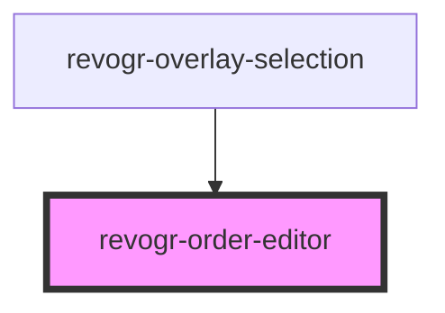

# revogr-order-editor

<!-- Auto Generated Below -->

## Properties

| Property       | Attribute | Description                                                     | Type                                                   | Default     |
| -------------- | --------- | --------------------------------------------------------------- | ------------------------------------------------------ | ----------- |
| `dataStore`    | --        | Static stores, not expected to change during component lifetime | `ObservableMap<DSourceState<DataType, DimensionRows>>` | `undefined` |
| `dimensionCol` | --        | Dimension settings X                                            | `ObservableMap<DimensionSettingsState>`                | `undefined` |
| `dimensionRow` | --        | Dimension settings Y                                            | `ObservableMap<DimensionSettingsState>`                | `undefined` |
| `parent`       | --        | Parent element                                                  | `HTMLElement`                                          | `undefined` |

## Events

| Event              | Description                                | Type                                                                               |
| ------------------ | ------------------------------------------ | ---------------------------------------------------------------------------------- |
| `rowdragendinit`   | Row drag ended                             | `CustomEvent<any>`                                                                 |
| `rowdragendinit`   | Row dragged, new range ready to be applied | `CustomEvent<{ from: number; to: number; }>`                                       |
| `rowdragmousemove` | Row mouse move                             | `CustomEvent<Cell>`                                                                |
| `rowdragmoveinit`  | Row move                                   | `CustomEvent<PositionItem>`                                                        |
| `rowdragstartinit` | Row drag started                           | `CustomEvent<{ cell: Cell; text: string; pos: PositionItem; event: MouseEvent; }>` |

## Methods

### `clearOrder() => Promise<void>`

#### Returns

Type: `Promise<void>`

### `dragStart(e: DragStartEvent) => Promise<void>`

#### Parameters

| Name | Type                                                           | Description |
| ---- | -------------------------------------------------------------- | ----------- |
| `e`  | `{ originalEvent: MouseEvent; model: ColumnDataSchemaModel; }` |             |

#### Returns

Type: `Promise<void>`

### `endOrder(e: MouseEvent) => Promise<void>`

#### Parameters

| Name | Type         | Description |
| ---- | ------------ | ----------- |
| `e`  | `MouseEvent` |             |

#### Returns

Type: `Promise<void>`

## Dependencies

### Used by

 - [revogr-overlay-selection](../overlay)

### Graph

----------------------------------------------

*Built with love by Revolist OU*
