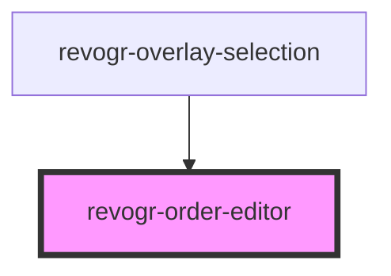

# revogr-order-editor

<!-- Auto Generated Below -->

## Properties

| Property       | Attribute | Description                                                     | Type                                                      | Default     |
| -------------- | --------- | --------------------------------------------------------------- | --------------------------------------------------------- | ----------- |
| `dataStore`    | --        | Static stores, not expected to change during component lifetime | `ObservableMap<DataSourceState<DataType, DimensionRows>>` | `undefined` |
| `dimensionCol` | --        |                                                                 | `ObservableMap<DimensionSettingsState>`                   | `undefined` |
| `dimensionRow` | --        |                                                                 | `ObservableMap<DimensionSettingsState>`                   | `undefined` |
| `parent`       | --        |                                                                 | `HTMLElement`                                             | `undefined` |

## Events

| Event                  | Description                                | Type                                                                               |
| ---------------------- | ------------------------------------------ | ---------------------------------------------------------------------------------- |
| `initialRowDropped`    | Row dragged, new range ready to be applied | `CustomEvent<{ from: number; to: number; }>`                                       |
| `internalRowDrag`      | Row move                                   | `CustomEvent<PositionItem>`                                                        |
| `internalRowDragEnd`   | Row drag ended                             | `CustomEvent<any>`                                                                 |
| `internalRowDragStart` | Row drag started                           | `CustomEvent<{ cell: Cell; text: string; pos: PositionItem; event: MouseEvent; }>` |
| `internalRowMouseMove` | Row mouse move                             | `CustomEvent<Cell>`                                                                |

## Methods

### `clearOrder() => Promise<void>`

#### Returns

Type: `Promise<void>`

### `dragStart(e: MouseEvent) => Promise<void>`

#### Returns

Type: `Promise<void>`

### `endOrder(e: MouseEvent) => Promise<void>`

#### Returns

Type: `Promise<void>`

## Dependencies

### Used by

- [revogr-overlay-selection](../overlay)

### Graph

---

_Built with [StencilJS](https://stenciljs.com/)_
