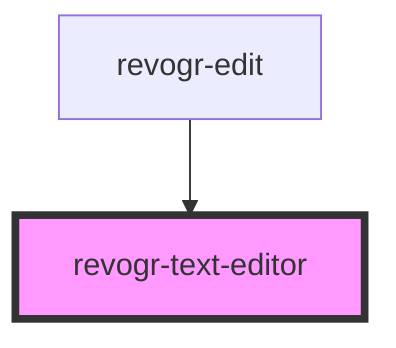

# revogr-text-editor

<!-- Auto Generated Below -->

## Properties

| Property | Attribute | Description | Type     | Default     |
| -------- | --------- | ----------- | -------- | ----------- |
| `value`  | `value`   |             | `string` | `undefined` |

## Events

| Event  | Description | Type                  |
| ------ | ----------- | --------------------- |
| `edit` |             | `CustomEvent<string>` |

## Dependencies

### Used by

 - [revogr-edit](.)

### Graph

----------------------------------------------

*Built with [StencilJS](https://stenciljs.com/)*
