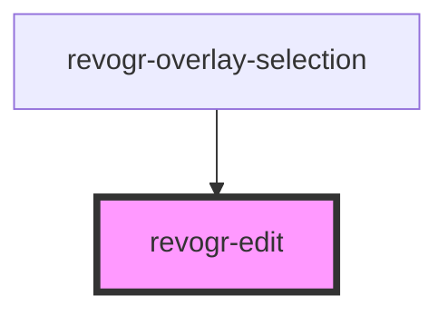

# revogr-edit

<!-- Auto Generated Below -->

## Properties

| Property   | Attribute | Description             | Type                                    | Default     |
| ---------- | --------- | ----------------------- | --------------------------------------- | ----------- |
| `column`   | --        |                         | `ColumnRegular`                         | `undefined` |
| `editCell` | --        |                         | `EditCellStore & BeforeSaveDataDetails` | `undefined` |
| `editor`   | --        | Custom editors register | `EditorCtr`                             | `undefined` |

## Events

| Event       | Description        | Type                                                                           |
| ----------- | ------------------ | ------------------------------------------------------------------------------ |
| `cellEdit`  |                    | `CustomEvent<{ row: number; col: number; val: any; preventFocus?: boolean; }>` |
| `closeEdit` | Close editor event | `CustomEvent<boolean>`                                                         |

## Dependencies

### Used by

- [revogr-overlay-selection](..)

### Graph

---

_Built with [StencilJS](https://stenciljs.com/)_
