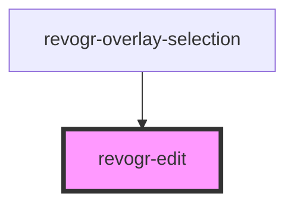

# revogr-text-editor

<!-- Auto Generated Below -->

## Properties

| Property   | Attribute | Description             | Type                      | Default     |
| ---------- | --------- | ----------------------- | ------------------------- | ----------- |
| `column`   | --        |                         | `ColumnDataSchemaRegular` | `undefined` |
| `editCell` | --        |                         | `EditCell`                | `undefined` |
| `editor`   | --        | Custom editors register | `EditorCtr`               | `undefined` |

## Events

| Event       | Description | Type                                                      |
| ----------- | ----------- | --------------------------------------------------------- |
| `cellEdit`  |             | `CustomEvent<{ row: number; col: number; val: string; }>` |
| `closeEdit` |             | `CustomEvent<any>`                                        |

## Dependencies

### Used by

 - [revogr-overlay-selection](../selection)

### Graph

----------------------------------------------

*Built with [StencilJS](https://stenciljs.com/)*
