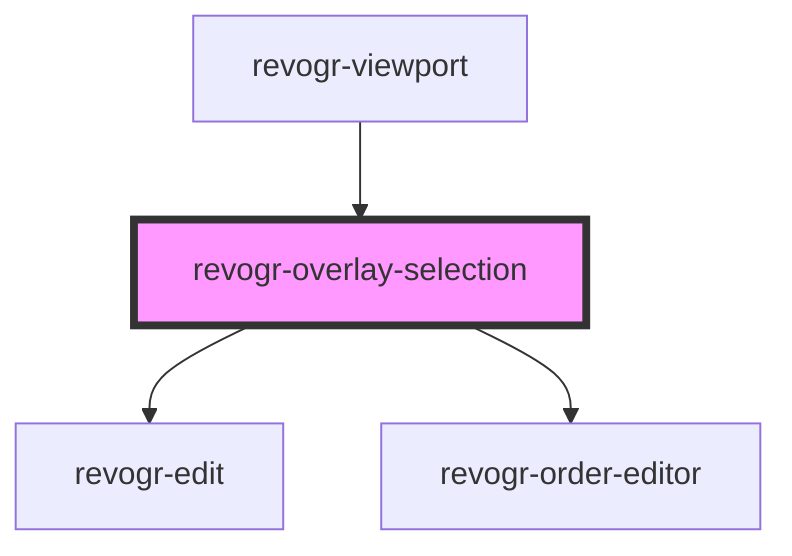

# revogr-overlay-selection

<!-- Auto Generated Below -->

## Properties

| Property         | Attribute  | Description                                                     | Type                                       | Default     |
| ---------------- | ---------- | --------------------------------------------------------------- | ------------------------------------------ | ----------- |
| `canDrag`        | `can-drag` |                                                                 | `boolean`                                  | `undefined` |
| `colData`        | --         |                                                                 | `ColumnDataSchemaRegular[]`                | `undefined` |
| `dataStore`      | --         | Static stores, not expected to change during component lifetime | `ObservableMap<DataSourceState<DataType>>` | `undefined` |
| `dimensionCol`   | --         |                                                                 | `ObservableMap<DimensionSettingsState>`    | `undefined` |
| `dimensionRow`   | --         |                                                                 | `ObservableMap<DimensionSettingsState>`    | `undefined` |
| `editors`        | --         | Custom editors register                                         | `{ [name: string]: EditorCtr; }`           | `undefined` |
| `lastCell`       | --         | Last cell position                                              | `Cell`                                     | `undefined` |
| `range`          | `range`    |                                                                 | `boolean`                                  | `undefined` |
| `readonly`       | `readonly` |                                                                 | `boolean`                                  | `undefined` |
| `selectionStore` | --         | Dynamic stores                                                  | `ObservableMap<SelectionStoreState>`       | `undefined` |

## Events

| Event              | Description             | Type                                                                                             |
| ------------------ | ----------------------- | ------------------------------------------------------------------------------------------------ |
| `afterEdit`        |                         | `CustomEvent<{ model: DataType; prop: ColumnProp; val: string; }>`                               |
| `beforeEdit`       |                         | `CustomEvent<{ model: DataType; prop: ColumnProp; val: string; }>`                               |
| `changeSelection`  |                         | `CustomEvent<{ changes: Partial<Cell>; isMulti?: boolean; }>`                                    |
| `focusCell`        |                         | `CustomEvent<{ focus: Cell; end: Cell; }>`                                                       |
| `selectionChanged` | Selection range changed | `CustomEvent<{ newRange: { start: Cell; end: Cell; }; oldRange: { start: Cell; end: Cell; }; }>` |
| `setEdit`          |                         | `CustomEvent<boolean \| string>`                                                                 |
| `unregister`       |                         | `CustomEvent<any>`                                                                               |

## Dependencies

### Used by

 - [revogr-viewport](../viewport)

### Depends on

- [revogr-edit](.)
- [revogr-order-editor](.)

### Graph

----------------------------------------------

*Built with [StencilJS](https://stenciljs.com/)*
