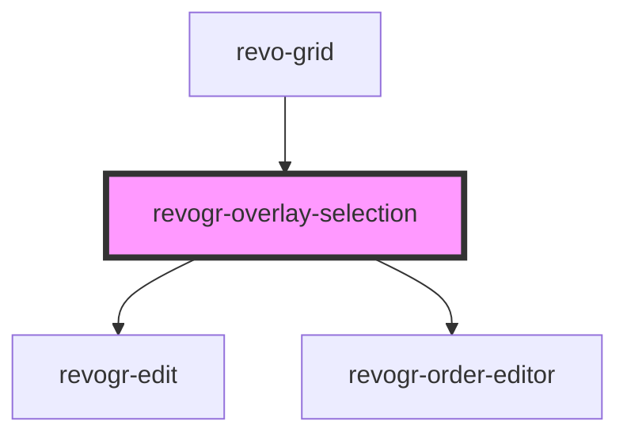

# revogr-overlay-selection

<!-- Auto Generated Below -->

## Properties

| Property         | Attribute       | Description                                                     | Type                                                           | Default     |
| ---------------- | --------------- | --------------------------------------------------------------- | -------------------------------------------------------------- | ----------- |
| `canDrag`        | `can-drag`      |                                                                 | `boolean`                                                      | `undefined` |
| `colData`        | --              |                                                                 | `ObservableMap<DataSourceState<ColumnRegular, DimensionCols>>` | `undefined` |
| `dataStore`      | --              | Static stores, not expected to change during component lifetime | `ObservableMap<DataSourceState<DataType, DimensionRows>>`      | `undefined` |
| `dimensionCol`   | --              |                                                                 | `ObservableMap<DimensionSettingsState>`                        | `undefined` |
| `dimensionRow`   | --              |                                                                 | `ObservableMap<DimensionSettingsState>`                        | `undefined` |
| `editors`        | --              | Custom editors register                                         | `{ [name: string]: EditorCtr; }`                               | `undefined` |
| `lastCell`       | --              | Last cell position                                              | `Cell`                                                         | `undefined` |
| `range`          | `range`         |                                                                 | `boolean`                                                      | `undefined` |
| `readonly`       | `readonly`      |                                                                 | `boolean`                                                      | `undefined` |
| `selectionStore` | --              | Dynamic stores                                                  | `ObservableMap<SelectionStoreState>`                           | `undefined` |
| `useClipboard`   | `use-clipboard` |                                                                 | `boolean`                                                      | `undefined` |

## Events

| Event                      | Description             | Type                                                                                                                                                  |
| -------------------------- | ----------------------- | ----------------------------------------------------------------------------------------------------------------------------------------------------- |
| `applyFocus`               |                         | `CustomEvent<FocusRenderEvent>`                                                                                                                       |
| `before-apply-range`       |                         | `CustomEvent<FocusRenderEvent>`                                                                                                                       |
| `before-edit-render`       |                         | `CustomEvent<FocusRenderEvent>`                                                                                                                       |
| `before-set-range`         |                         | `CustomEvent<any>`                                                                                                                                    |
| `beforeFocusCell`          |                         | `CustomEvent<{ prop: ColumnProp; model: DataType; val?: string; rowIndex: number; type: DimensionRows; }>`                                            |
| `beforeRangeCopyApply`     | Selection range changed | `CustomEvent<{ type: DimensionRows; newRange: RangeArea; oldRange: RangeArea; mapping: OldNewRangeMapping; newData: { [key: number]: DataType; }; }>` |
| `beforeRangeDataApply`     | Range data apply        | `CustomEvent<FocusRenderEvent>`                                                                                                                       |
| `focusCell`                |                         | `CustomEvent<AllDimensionType & FocusedCells>`                                                                                                        |
| `internalCellEdit`         |                         | `CustomEvent<{ prop: ColumnProp; model: DataType; val?: string; rowIndex: number; type: DimensionRows; }>`                                            |
| `internalCopy`             |                         | `CustomEvent<any>`                                                                                                                                    |
| `internalPaste`            |                         | `CustomEvent<any>`                                                                                                                                    |
| `internalRangeDataApply`   | Range data apply        | `CustomEvent<{ data: DataLookup; models: { [rowIndex: number]: DataType; }; type: DimensionRows; }>`                                                  |
| `internalSelectionChanged` | Selection range changed | `CustomEvent<{ type: DimensionRows; newRange: RangeArea; oldRange: RangeArea; mapping: OldNewRangeMapping; newData: { [key: number]: DataType; }; }>` |
| `rangeClipboardCopy`       | Range copy              | `CustomEvent<any>`                                                                                                                                    |
| `rangeClipboardPaste`      |                         | `CustomEvent<any>`                                                                                                                                    |
| `setEdit`                  |                         | `CustomEvent<{ isCancel: boolean; } & BeforeSaveDataDetails>`                                                                                         |
| `setRange`                 |                         | `CustomEvent<RangeArea & { type: MultiDimensionType; }>`                                                                                              |
| `setTempRange`             |                         | `CustomEvent<{ type: string; area: RangeArea; }>`                                                                                                     |

## Dependencies

### Used by

 - [revo-grid](../revoGrid)

### Depends on

- [revogr-edit](.)
- [revogr-order-editor](../order)

### Graph

----------------------------------------------

*Built with [StencilJS](https://stenciljs.com/)*
