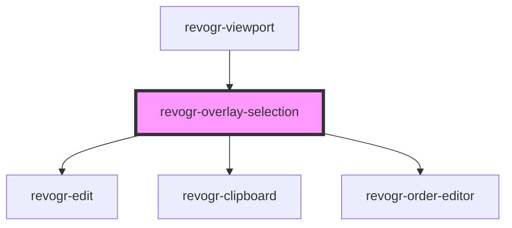

# revogr-overlay-selection

<!-- Auto Generated Below -->

## Properties

| Property         | Attribute  | Description                                                     | Type                                                      | Default     |
| ---------------- | ---------- | --------------------------------------------------------------- | --------------------------------------------------------- | ----------- |
| `canDrag`        | `can-drag` |                                                                 | `boolean`                                                 | `undefined` |
| `colData`        | --         |                                                                 | `ColumnRegular[]`                                         | `undefined` |
| `dataStore`      | --         | Static stores, not expected to change during component lifetime | `ObservableMap<DataSourceState<DataType, DimensionRows>>` | `undefined` |
| `dimensionCol`   | --         |                                                                 | `ObservableMap<DimensionSettingsState>`                   | `undefined` |
| `dimensionRow`   | --         |                                                                 | `ObservableMap<DimensionSettingsState>`                   | `undefined` |
| `editors`        | --         | Custom editors register                                         | `{ [name: string]: EditorCtr; }`                          | `undefined` |
| `lastCell`       | --         | Last cell position                                              | `Cell`                                                    | `undefined` |
| `range`          | `range`    |                                                                 | `boolean`                                                 | `undefined` |
| `readonly`       | `readonly` |                                                                 | `boolean`                                                 | `undefined` |
| `selectionFocus` | --         |                                                                 | `Cell`                                                    | `undefined` |
| `selectionRange` | --         |                                                                 | `{ x: number; y: number; x1: number; y1: number; }`       | `undefined` |
| `selectionStore` | --         | Dynamic stores                                                  | `ObservableMap<SelectionStoreState>`                      | `undefined` |

## Events

| Event                      | Description             | Type                                                                                                                                                                     |
| -------------------------- | ----------------------- | ------------------------------------------------------------------------------------------------------------------------------------------------------------------------ |
| `changeSelection`          |                         | `CustomEvent<{ changes: Partial<Cell>; isMulti?: boolean; }>`                                                                                                            |
| `focusCell`                |                         | `CustomEvent<{ focus: Cell; end: Cell; }>`                                                                                                                               |
| `internalCellEdit`         |                         | `CustomEvent<{ prop: ColumnProp; model: DataType; val?: string; rowIndex: number; type: DimensionRows; }>`                                                               |
| `internalCopy`             |                         | `CustomEvent<any>`                                                                                                                                                       |
| `internalFocusCell`        |                         | `CustomEvent<{ prop: ColumnProp; model: DataType; val?: string; rowIndex: number; type: DimensionRows; }>`                                                               |
| `internalPaste`            |                         | `CustomEvent<any>`                                                                                                                                                       |
| `internalRangeDataApply`   | Range data apply        | `CustomEvent<{ data: DataLookup; type: DimensionRows; }>`                                                                                                                |
| `internalSelectionChanged` | Selection range changed | `CustomEvent<{ type: DimensionRows; newRange: RangeArea; oldRange: RangeArea; newProps: ColumnProp[]; oldProps: ColumnProp[]; newData: { [key: number]: DataType; }; }>` |
| `setEdit`                  |                         | `CustomEvent<boolean \| string>`                                                                                                                                         |
| `unregister`               |                         | `CustomEvent<any>`                                                                                                                                                       |

## Dependencies

### Used by

 - [revogr-viewport](../viewport)

### Depends on

- [revogr-edit](.)
- [revogr-clipboard](../clipboard)
- [revogr-order-editor](../order)

### Graph

----------------------------------------------

*Built with [StencilJS](https://stenciljs.com/)*
