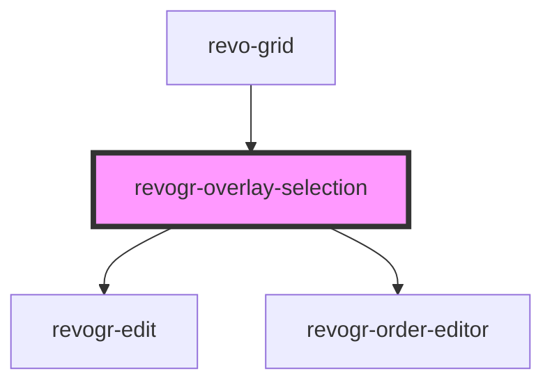

# revogr-overlay-selection

<!-- Auto Generated Below -->

## Properties

| Property              | Attribute                | Description                                                                                   | Type                                                        | Default     |
| --------------------- | ------------------------ | --------------------------------------------------------------------------------------------- | ----------------------------------------------------------- | ----------- |
| `additionalData`      | `additional-data`        | Additional data to pass to renderer                                                           | `any`                                                       | `undefined` |
| `applyChangesOnClose` | `apply-changes-on-close` | If true applys changes when cell closes if not Escape                                         | `boolean`                                                   | `false`     |
| `canDrag`             | `can-drag`               | Enable revogr-order-editor component (read more in revogr-order-editor component) Allows D&D  | `boolean`                                                   | `undefined` |
| `colData`             | --                       | Column data store                                                                             | `ObservableMap<DSourceState<ColumnRegular, DimensionCols>>` | `undefined` |
| `dataStore`           | --                       | Row data store                                                                                | `ObservableMap<DSourceState<DataType, DimensionRows>>`      | `undefined` |
| `dimensionCol`        | --                       |                                                                                               | `ObservableMap<DimensionSettingsState>`                     | `undefined` |
| `dimensionRow`        | --                       |                                                                                               | `ObservableMap<DimensionSettingsState>`                     | `undefined` |
| `editors`             | --                       | Custom editors register                                                                       | `{ [name: string]: EditorCtr; }`                            | `undefined` |
| `isMobileDevice`      | `is-mobile-device`       | Is mobile view mode                                                                           | `boolean`                                                   | `undefined` |
| `lastCell`            | --                       | Last cell position                                                                            | `Cell`                                                      | `undefined` |
| `range`               | `range`                  | Range selection mode                                                                          | `boolean`                                                   | `undefined` |
| `readonly`            | `readonly`               | If readonly mode enables                                                                      | `boolean`                                                   | `undefined` |
| `selectionStore`      | --                       |                                                                                               | `ObservableMap<SelectionStoreState>`                        | `undefined` |
| `useClipboard`        | `use-clipboard`          | Enable revogr-clipboard component (read more in revogr-clipboard component) Allows copy/paste | `boolean`                                                   | `undefined` |

## Events

| Event                      | Description                                                                                                                                                                                     | Type                                                                                                                                                                          |
| -------------------------- | ----------------------------------------------------------------------------------------------------------------------------------------------------------------------------------------------- | ----------------------------------------------------------------------------------------------------------------------------------------------------------------------------- |
| `applyFocus`               |                                                                                                                                                                                                 | `CustomEvent<FocusRenderEvent>`                                                                                                                                               |
| `before-apply-range`       |                                                                                                                                                                                                 | `CustomEvent<FocusRenderEvent>`                                                                                                                                               |
| `before-cell-save`         | Runs before cell save Can be used to override or cancel original save                                                                                                                           | `CustomEvent<any>`                                                                                                                                                            |
| `before-edit-render`       |                                                                                                                                                                                                 | `CustomEvent<FocusRenderEvent>`                                                                                                                                               |
| `before-set-range`         | Before range selection applied                                                                                                                                                                  | `CustomEvent<any>`                                                                                                                                                            |
| `beforeFocusCell`          |                                                                                                                                                                                                 | `CustomEvent<{ prop: ColumnProp; model: DataType; val?: string; rowIndex: number; colIndex: number; colType: DimensionCols; type: DimensionRows; }>`                          |
| `beforekeydown`            | Before key up event proxy, used to prevent key up trigger. If you have some custom behaviour event, use this event to check if it wasn't processed by internal logic. Call preventDefault()     | `CustomEvent<KeyboardEvent>`                                                                                                                                                  |
| `beforekeyup`              | Before key down event proxy, used to prevent key down trigger. If you have some custom behaviour event, use this event to check if it wasn't processed by internal logic. Call preventDefault() | `CustomEvent<KeyboardEvent>`                                                                                                                                                  |
| `beforeRangeCopyApply`     | Selection range changed                                                                                                                                                                         | `CustomEvent<{ type: DimensionRows; colType: DimensionCols; newRange: RangeArea; oldRange: RangeArea; mapping: OldNewRangeMapping; newData: { [key: number]: DataType; }; }>` |
| `beforeRangeDataApply`     | Range data apply                                                                                                                                                                                | `CustomEvent<FocusRenderEvent>`                                                                                                                                               |
| `cancelEdit`               | Used for editors support when close requested                                                                                                                                                   | `CustomEvent<any>`                                                                                                                                                            |
| `focusCell`                |                                                                                                                                                                                                 | `CustomEvent<AllDimensionType & FocusedCells>`                                                                                                                                |
| `internalCellEdit`         |                                                                                                                                                                                                 | `CustomEvent<{ prop: ColumnProp; model: DataType; val?: string; rowIndex: number; colIndex: number; colType: DimensionCols; type: DimensionRows; }>`                          |
| `internalCopy`             | Before clipboard copy happened                                                                                                                                                                  | `CustomEvent<any>`                                                                                                                                                            |
| `internalPaste`            | Before paste happened                                                                                                                                                                           | `CustomEvent<any>`                                                                                                                                                            |
| `internalRangeDataApply`   | Range data apply                                                                                                                                                                                | `CustomEvent<{ data: DataLookup; models: { [rowIndex: number]: DataType; }; type: DimensionRows; }>`                                                                          |
| `internalSelectionChanged` | Selection range changed                                                                                                                                                                         | `CustomEvent<{ type: DimensionRows; colType: DimensionCols; newRange: RangeArea; oldRange: RangeArea; mapping: OldNewRangeMapping; newData: { [key: number]: DataType; }; }>` |
| `rangeClipboardCopy`       | Range copy                                                                                                                                                                                      | `CustomEvent<any>`                                                                                                                                                            |
| `rangeClipboardPaste`      |                                                                                                                                                                                                 | `CustomEvent<any>`                                                                                                                                                            |
| `selectall`                |                                                                                                                                                                                                 | `CustomEvent<any>`                                                                                                                                                            |
| `setEdit`                  | Set edit cell                                                                                                                                                                                   | `CustomEvent<{ prop: ColumnProp; model: DataType; val?: string; rowIndex: number; colIndex: number; colType: DimensionCols; type: DimensionRows; }>`                          |
| `setRange`                 |                                                                                                                                                                                                 | `CustomEvent<RangeArea & { type: MultiDimensionType; }>`                                                                                                                      |
| `setTempRange`             |                                                                                                                                                                                                 | `CustomEvent<{ type: string; area: RangeArea; }>`                                                                                                                             |

## Dependencies

### Used by

 - [revo-grid](../revoGrid)

### Depends on

- [revogr-edit](.)
- [revogr-order-editor](../order)

### Graph

----------------------------------------------

*Built with [StencilJS](https://stenciljs.com/)*
