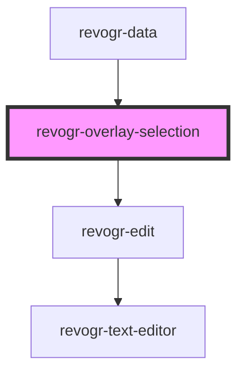

# revogr-overlay-selection

<!-- Auto Generated Below -->

## Properties

| Property        | Attribute  | Description | Type                                    | Default     |
| --------------- | ---------- | ----------- | --------------------------------------- | ----------- |
| `columnService` | --         |             | `ColumnServiceI`                        | `undefined` |
| `dimensionCol`  | --         |             | `ObservableMap<DimensionSettingsState>` | `undefined` |
| `dimensionRow`  | --         |             | `ObservableMap<DimensionSettingsState>` | `undefined` |
| `lastCell`      | --         |             | `Cell`                                  | `undefined` |
| `parent`        | `parent`   |             | `string`                                | `''`        |
| `position`      | --         |             | `Cell`                                  | `undefined` |
| `readonly`      | `readonly` |             | `boolean`                               | `undefined` |

## Dependencies

### Used by

 - [revogr-data](../../data)

### Depends on

- [revogr-edit](../editors)

### Graph

----------------------------------------------

*Built with [StencilJS](https://stenciljs.com/)*
