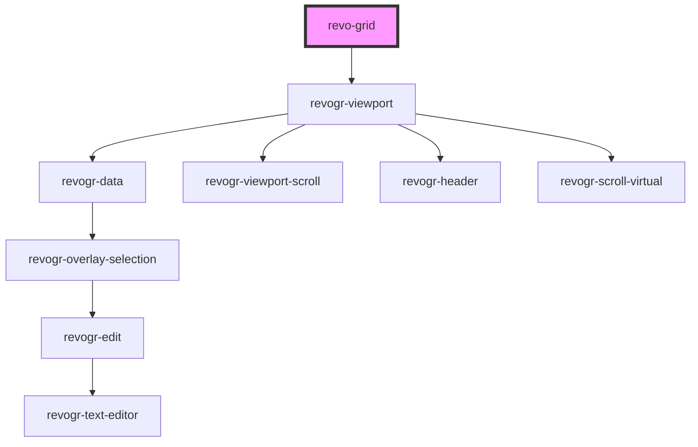

# grid-component

<!-- Auto Generated Below -->

## Properties

| Property             | Attribute    | Description                                                                                                                                                                  | Type                                                      | Default                             |
| -------------------- | ------------ | ---------------------------------------------------------------------------------------------------------------------------------------------------------------------------- | --------------------------------------------------------- | ----------------------------------- |
| `colSize`            | `col-size`   | Indicates default column size.                                                                                                                                               | `number`                                                  | `initialSettings.defaultColumnSize` |
| `columns`            | --           | Columns - defines an array of grid columns. Can be column or grouped column.                                                                                                 | `(ColumnDataSchemaRegular \| ColumnDataSchemaGrouping)[]` | `[]`                                |
| `frameSize`          | `frame-size` | Defines how many rows/columns should be rendered outside visible area.                                                                                                       | `number`                                                  | `initialSettings.frameSize`         |
| `pinnedBottomSource` | --           | Pinned bottom Source: {[T in ColumnProp]: any} - defines pinned bottom rows data source.                                                                                     | `DataType[]`                                              | `[]`                                |
| `pinnedTopSource`    | --           | Pinned top Source: {[T in ColumnProp]: any} - defines pinned top rows data source.                                                                                           | `DataType[]`                                              | `[]`                                |
| `range`              | `range`      | When true, user can range selection.                                                                                                                                         | `boolean`                                                 | `initialSettings.range`             |
| `readonly`           | `readonly`   | When true, grid in read only mode.                                                                                                                                           | `boolean`                                                 | `initialSettings.readonly`          |
| `resize`             | `resize`     | When true, columns are resizable.                                                                                                                                            | `boolean`                                                 | `initialSettings.resize`            |
| `rowSize`            | `row-size`   | Indicates default row size.                                                                                                                                                  | `number`                                                  | `initialSettings.defaultRowSize`    |
| `source`             | --           | Source: {[T in ColumnProp]: any} - defines main data source. Can be an Object or 2 dimensional array([][]); ColumnProp - string\|number. It is reference for column mapping. | `DataType[]`                                              | `[]`                                |

## Dependencies

### Depends on

- [revogr-viewport](../viewport)

### Graph

----------------------------------------------

*Built with [StencilJS](https://stenciljs.com/)*
