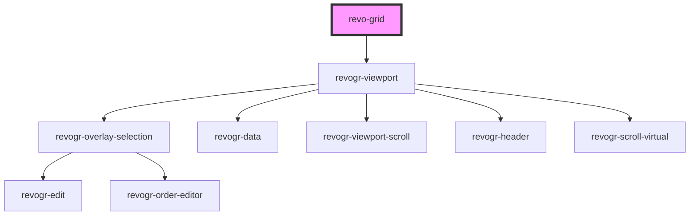

# revo-grid

<!-- Auto Generated Below -->

## Properties

| Property             | Attribute    | Description                                                                                                                 | Type                                  | Default     |
| -------------------- | ------------ | --------------------------------------------------------------------------------------------------------------------------- | ------------------------------------- | ----------- |
| `colSize`            | `col-size`   | Indicates default column size.                                                                                              | `number`                              | `100`       |
| `columns`            | --           | Columns - defines an array of grid columns. Can be column or grouped column.                                                | `(ColumnRegular \| ColumnGrouping)[]` | `[]`        |
| `editors`            | --           | Custom editors register                                                                                                     | `{ [name: string]: EditorCtr; }`      | `{}`        |
| `frameSize`          | `frame-size` | Defines how many rows/columns should be rendered outside visible area.                                                      | `number`                              | `0`         |
| `pinnedBottomSource` | --           | Pinned bottom Source: {[T in ColumnProp]: any} - defines pinned bottom rows data source.                                    | `DataType[]`                          | `[]`        |
| `pinnedTopSource`    | --           | Pinned top Source: {[T in ColumnProp]: any} - defines pinned top rows data source.                                          | `DataType[]`                          | `[]`        |
| `range`              | `range`      | When true, user can range selection.                                                                                        | `boolean`                             | `false`     |
| `readonly`           | `readonly`   | When true, grid in read only mode.                                                                                          | `boolean`                             | `false`     |
| `resize`             | `resize`     | When true, columns are resizable.                                                                                           | `boolean`                             | `false`     |
| `rowSize`            | `row-size`   | Indicates default row size.                                                                                                 | `number`                              | `42`        |
| `source`             | --           | Source - defines main data source. Can be an Object or 2 dimensional array([][]); Keys/indexes referenced from columns Prop | `DataType[]`                          | `[]`        |
| `theme`              | `theme`      | Theme name                                                                                                                  | `"default" \| "material"`             | `'default'` |

## Events

| Event             | Description                                                                                                                                                                             | Type                                                                                             |
| ----------------- | --------------------------------------------------------------------------------------------------------------------------------------------------------------------------------------- | ------------------------------------------------------------------------------------------------ |
| `afterEdit`       | After edit. Triggered when after data applied.                                                                                                                                          | `CustomEvent<{ prop: ColumnProp; val: string; rowIndex: number; type: DimensionRows; }>`         |
| `beforeAutofill`  | Before autofill. Triggered before autofill applied. Use e.preventDefault() to prevent edit data apply.                                                                                  | `CustomEvent<{ newRange: { start: Cell; end: Cell; }; oldRange: { start: Cell; end: Cell; }; }>` |
| `beforeEdit`      | Before edit event. Triggered before edit data applied. Use e.preventDefault() to prevent edit data set and use you own.  Use e.val = {your value} to replace edit result with your own. | `CustomEvent<{ prop: ColumnProp; val: string; rowIndex: number; type: DimensionRows; }>`         |
| `beforeRange`     | Before range apply. Triggered before range applied. Use e.preventDefault() to prevent range.                                                                                            | `CustomEvent<{ newRange: { start: Cell; end: Cell; }; oldRange: { start: Cell; end: Cell; }; }>` |
| `headerClick`     | On header click.                                                                                                                                                                        | `CustomEvent<ColumnRegular>`                                                                     |
| `rowOrderChanged` | Before row order apply. Use e.preventDefault() to prevent row order change.                                                                                                             | `CustomEvent<{ from: number; to: number; }>`                                                     |

## Dependencies

### Depends on

- [revogr-viewport](../viewport)

### Graph

----------------------------------------------

*Built with [StencilJS](https://stenciljs.com/)*
