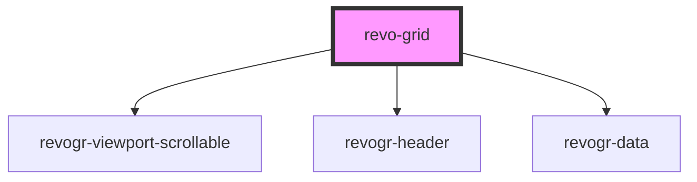

# grid-component

<!-- Auto Generated Below -->

## Properties

| Property     | Attribute | Description | Type                                                                                                                                                | Default           |
| ------------ | --------- | ----------- | --------------------------------------------------------------------------------------------------------------------------------------------------- | ----------------- |
| `columns`    | --        |             | `ColumnDataSchema[]`                                                                                                                                | `[]`              |
| `dimensions` | --        |             | `{ col?: ViewSettingSizeProp; row?: ViewSettingSizeProp; }`                                                                                         | `{}`              |
| `settings`   | --        |             | `{ defaultColumnSize: number; defaultRowSize: number; frameSize: number; dimensions?: { col?: ViewSettingSizeProp; row?: ViewSettingSizeProp; }; }` | `initialSettings` |
| `source`     | --        |             | `DataType[]`                                                                                                                                        | `[]`              |

## Dependencies

### Depends on

- [revogr-viewport-scrollable](../scrollable)
- [revogr-header](../header)
- [revogr-data](../data)

### Graph

----------------------------------------------

*Built with [StencilJS](https://stenciljs.com/)*
