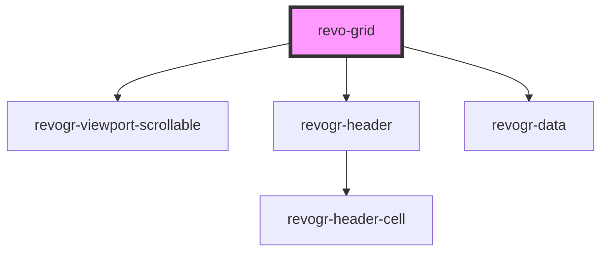

# grid-component

<!-- Auto Generated Below -->

## Properties

| Property     | Attribute | Description | Type                                                                        | Default           |
| ------------ | --------- | ----------- | --------------------------------------------------------------------------- | ----------------- |
| `dimensions` | --        |             | `{ col?: ViewSettingSizeProp; row?: ViewSettingSizeProp; }`                 | `{}`              |
| `headers`    | --        |             | `ColumnDataSchema[] \| string[] \| { [key: string]: ColumnDataSchema; }`    | `[]`              |
| `settings`   | --        |             | `{ defaultColumnSize: number; defaultRowSize: number; frameSize: number; }` | `initialSettings` |
| `source`     | --        |             | `string[][] \| { [key: string]: { [key: string]: string; }; }`              | `[]`              |

## Dependencies

### Depends on

- [revogr-viewport-scrollable](../scrollable)
- [revogr-header](../header)
- [revogr-data](../data)

### Graph

----------------------------------------------

*Built with [StencilJS](https://stenciljs.com/)*
