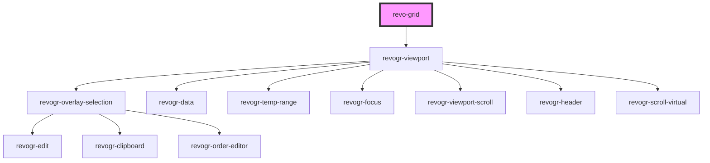

# revo-grid

<!-- Auto Generated Below -->

## Properties

| Property             | Attribute    | Description                                                                                                                 | Type                                                                      | Default     |
| -------------------- | ------------ | --------------------------------------------------------------------------------------------------------------------------- | ------------------------------------------------------------------------- | ----------- |
| `canFocus`           | `can-focus`  | When true cell focus appear.                                                                                                | `boolean`                                                                 | `true`      |
| `colSize`            | `col-size`   | Indicates default column size.                                                                                              | `number`                                                                  | `100`       |
| `columns`            | --           | Columns - defines an array of grid columns. Can be column or grouped column.                                                | `(ColumnRegular \| ColumnGrouping)[]`                                     | `[]`        |
| `editors`            | --           | Custom editors register                                                                                                     | `{ [name: string]: EditorCtr; }`                                          | `{}`        |
| `frameSize`          | `frame-size` | Defines how many rows/columns should be rendered outside visible area.                                                      | `number`                                                                  | `5`         |
| `pinnedBottomSource` | --           | Pinned bottom Source: {[T in ColumnProp]: any} - defines pinned bottom rows data source.                                    | `DataType[]`                                                              | `[]`        |
| `pinnedTopSource`    | --           | Pinned top Source: {[T in ColumnProp]: any} - defines pinned top rows data source.                                          | `DataType[]`                                                              | `[]`        |
| `range`              | `range`      | When true, user can range selection.                                                                                        | `boolean`                                                                 | `false`     |
| `readonly`           | `readonly`   | When true, grid in read only mode.                                                                                          | `boolean`                                                                 | `false`     |
| `resize`             | `resize`     | When true, columns are resizable.                                                                                           | `boolean`                                                                 | `false`     |
| `rowClass`           | `row-class`  | Row class property Define this property in row object and this will be mapped as row class                                  | `string`                                                                  | `''`        |
| `rowSize`            | `row-size`   | Indicates default row size. By default 0, means theme package size will be applied                                          | `number`                                                                  | `0`         |
| `source`             | --           | Source - defines main data source. Can be an Object or 2 dimensional array([][]); Keys/indexes referenced from columns Prop | `DataType[]`                                                              | `[]`        |
| `theme`              | `theme`      | Theme name                                                                                                                  | `"compact" \| "darkCompact" \| "darkMaterial" \| "default" \| "material"` | `'default'` |

## Events

| Event                      | Description                                                                                                                                                                             | Type                                                                                                                                                                     |
| -------------------------- | --------------------------------------------------------------------------------------------------------------------------------------------------------------------------------------- | ------------------------------------------------------------------------------------------------------------------------------------------------------------------------ |
| `afterEdit`                | After edit. Triggered when after data applied or Range changeged.                                                                                                                       | `CustomEvent<{ data: DataLookup; type: DimensionRows; } \| { prop: ColumnProp; model: DataType; val?: string; rowIndex: number; type: DimensionRows; }>`                 |
| `beforeAutofill`           | Before autofill. Triggered before autofill applied. Use e.preventDefault() to prevent edit data apply.                                                                                  | `CustomEvent<{ type: DimensionRows; newRange: RangeArea; oldRange: RangeArea; newProps: ColumnProp[]; oldProps: ColumnProp[]; newData: { [key: number]: DataType; }; }>` |
| `beforeCellFocus`          | Before cell focus changed. Use e.preventDefault() to prevent cell focus change.                                                                                                         | `CustomEvent<{ prop: ColumnProp; model: DataType; val?: string; rowIndex: number; type: DimensionRows; }>`                                                               |
| `beforeEdit`               | Before edit event. Triggered before edit data applied. Use e.preventDefault() to prevent edit data set and use you own.  Use e.val = {your value} to replace edit result with your own. | `CustomEvent<{ prop: ColumnProp; model: DataType; val?: string; rowIndex: number; type: DimensionRows; }>`                                                               |
| `beforeRange`              | Before range apply. Triggered before range applied. Use e.preventDefault() to prevent range.                                                                                            | `CustomEvent<{ type: DimensionRows; newRange: RangeArea; oldRange: RangeArea; newProps: ColumnProp[]; oldProps: ColumnProp[]; newData: { [key: number]: DataType; }; }>` |
| `beforeRangeEdit`          | Before range edit event. Triggered before range data applied, when range selection happened. Use e.preventDefault() to prevent edit data set and use you own.                           | `CustomEvent<{ data: DataLookup; type: DimensionRows; }>`                                                                                                                |
| `beforeSorting`            | Before sorting event. Initial sorting triggered, if this event stops no other event called. Use e.preventDefault() to prevent sorting.                                                  | `CustomEvent<{ column: ColumnRegular; order: "desc" \| "asc"; }>`                                                                                                        |
| `beforeSortingApply`       | Before sorting apply. Use e.preventDefault() to prevent sorting data change.                                                                                                            | `CustomEvent<{ column: ColumnRegular; order: "desc" \| "asc"; }>`                                                                                                        |
| `beforeSourceSortingApply` | Before source update sorting apply. Use this event if you intended to prevent sorting on data update. Use e.preventDefault() to prevent sorting data change during rows source update.  | `CustomEvent<any>`                                                                                                                                                       |
| `headerClick`              | On header click.                                                                                                                                                                        | `CustomEvent<ColumnRegular>`                                                                                                                                             |
| `rowDragStart`             | Row order change started. Use e.preventDefault() to prevent row order change.  Use e.text = 'new name' to change item name on start.                                                    | `CustomEvent<{ pos: PositionItem; text: string; }>`                                                                                                                      |
| `rowOrderChanged`          | Before row order apply. Use e.preventDefault() to prevent row order change.                                                                                                             | `CustomEvent<{ from: number; to: number; }>`                                                                                                                             |

## Methods

### `refresh(type?: RevoGrid.DimensionRows | 'all') => Promise<void>`

Refreshes data viewport.
Can be specific part as row or pinned row or 'all' by default.

#### Returns

Type: `Promise<void>`

### `scrollToColumnIndex(coordinate?: number) => Promise<void>`

Scrolls view port to specified column index

#### Returns

Type: `Promise<void>`

### `scrollToColumnProp(prop: RevoGrid.ColumnProp) => Promise<void>`

Scrolls view port to specified column prop

#### Returns

Type: `Promise<void>`

### `scrollToCoordinate(cell: Partial<Selection.Cell>) => Promise<void>`

Scrolls view port to coordinate

#### Returns

Type: `Promise<void>`

### `scrollToRow(coordinate?: number) => Promise<void>`

Scrolls view port to specified row index

#### Returns

Type: `Promise<void>`

### `setCellEdit(row: number, prop: RevoGrid.ColumnProp, rowSource?: RevoGrid.DimensionRows) => Promise<void>`

Bring cell to edit mode

#### Returns

Type: `Promise<void>`

## Dependencies

### Depends on

- [revogr-viewport](../viewport)

### Graph

----------------------------------------------

*Built with [StencilJS](https://stenciljs.com/)*
