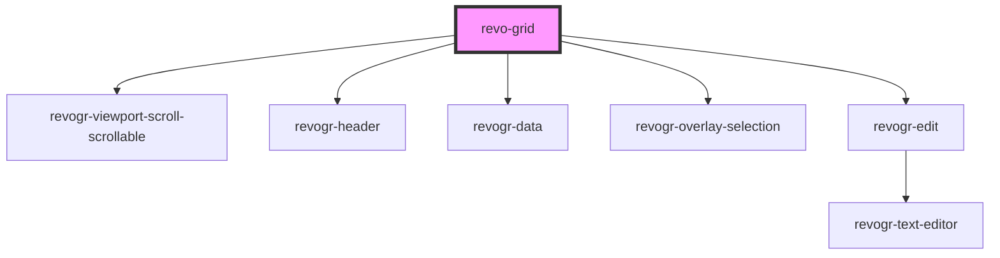

# grid-component

<!-- Auto Generated Below -->

## Properties

| Property     | Attribute    | Description | Type                                                        | Default                             |
| ------------ | ------------ | ----------- | ----------------------------------------------------------- | ----------------------------------- |
| `colSize`    | `col-size`   |             | `number`                                                    | `initialSettings.defaultColumnSize` |
| `columns`    | --           |             | `ColumnDataSchema[]`                                        | `[]`                                |
| `dimensions` | --           |             | `{ col?: ViewSettingSizeProp; row?: ViewSettingSizeProp; }` | `{}`                                |
| `frameSize`  | `frame-size` |             | `number`                                                    | `initialSettings.frameSize`         |
| `range`      | `range`      |             | `boolean`                                                   | `initialSettings.range`             |
| `readonly`   | `readonly`   |             | `boolean`                                                   | `initialSettings.readonly`          |
| `rowSize`    | `row-size`   |             | `number`                                                    | `initialSettings.defaultRowSize`    |
| `source`     | --           |             | `DataType[]`                                                | `[]`                                |

## Dependencies

### Depends on

- [revogr-viewport-scroll-scrollable](../scrollable)
- [revogr-header](../header)
- [revogr-data](../data)
- [revogr-overlay-selection](../overlay)
- [revogr-edit](../overlay)

### Graph

----------------------------------------------

*Built with [StencilJS](https://stenciljs.com/)*
