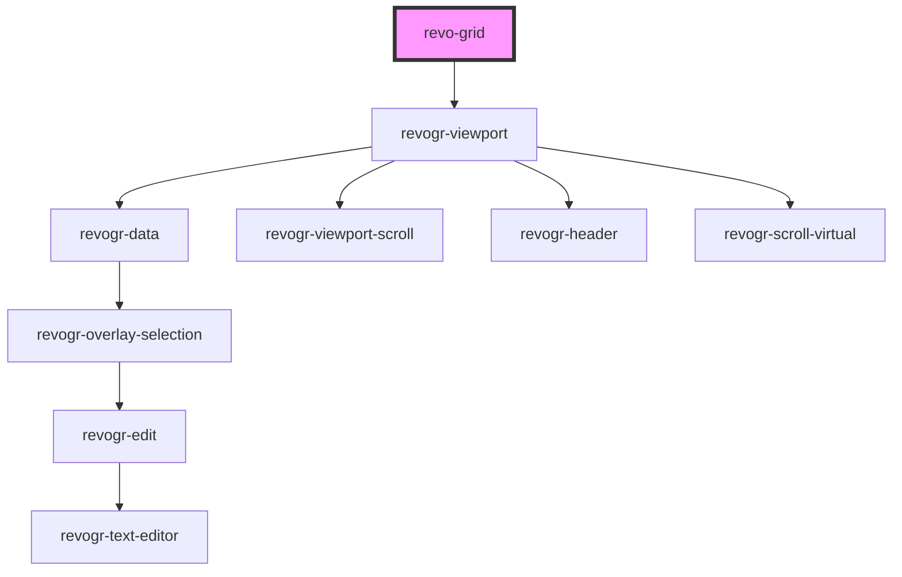

# grid-component

<!-- Auto Generated Below -->

## Properties

| Property             | Attribute    | Description | Type                 | Default                             |
| -------------------- | ------------ | ----------- | -------------------- | ----------------------------------- |
| `colSize`            | `col-size`   |             | `number`             | `initialSettings.defaultColumnSize` |
| `columns`            | --           |             | `ColumnDataSchema[]` | `[]`                                |
| `frameSize`          | `frame-size` |             | `number`             | `initialSettings.frameSize`         |
| `pinnedBottomSource` | --           |             | `DataType[]`         | `[]`                                |
| `pinnedTopSource`    | --           |             | `DataType[]`         | `[]`                                |
| `range`              | `range`      |             | `boolean`            | `initialSettings.range`             |
| `readonly`           | `readonly`   |             | `boolean`            | `initialSettings.readonly`          |
| `resize`             | `resize`     |             | `boolean`            | `initialSettings.resize`            |
| `rowSize`            | `row-size`   |             | `number`             | `initialSettings.defaultRowSize`    |
| `source`             | --           |             | `DataType[]`         | `[]`                                |

## Dependencies

### Depends on

- [revogr-viewport](../viewport)

### Graph

----------------------------------------------

*Built with [StencilJS](https://stenciljs.com/)*
