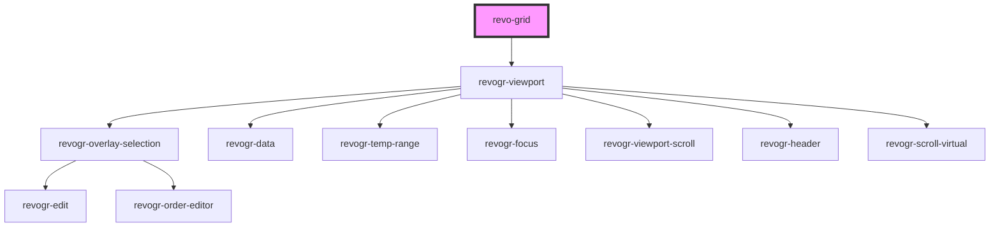

# revo-grid

<!-- Auto Generated Below -->

## Properties

| Property             | Attribute          | Description                                                                                                                                                                                                                                             | Type                                                                                                                                      | Default     |
| -------------------- | ------------------ | ------------------------------------------------------------------------------------------------------------------------------------------------------------------------------------------------------------------------------------------------------- | ----------------------------------------------------------------------------------------------------------------------------------------- | ----------- |
| `autoSizeColumn`     | `auto-size-column` | Autosize config Enable columns autoSize, for more details check @autoSizeColumn plugin By default disabled, hence operation is not resource efficient true to enable with default params (double header separator click for autosize) or provide config | `boolean \| { mode?: ColumnAutoSizeMode; allColumns?: boolean; letterBlockSize?: number; preciseSize?: boolean; }`                        | `false`     |
| `canFocus`           | `can-focus`        | When true cell focus appear.                                                                                                                                                                                                                            | `boolean`                                                                                                                                 | `true`      |
| `colSize`            | `col-size`         | Indicates default column size.                                                                                                                                                                                                                          | `number`                                                                                                                                  | `100`       |
| `columnTypes`        | --                 | Types Every type represent multiple column properties Types will be merged but can be replaced with column properties                                                                                                                                   | `{ [name: string]: ColumnType; }`                                                                                                         | `{}`        |
| `columns`            | --                 | Columns - defines an array of grid columns. Can be column or grouped column.                                                                                                                                                                            | `(ColumnRegular \| ColumnGrouping)[]`                                                                                                     | `[]`        |
| `editors`            | --                 | Custom editors register                                                                                                                                                                                                                                 | `{ [name: string]: EditorCtr; }`                                                                                                          | `{}`        |
| `exporting`          | `exporting`        | Enables export plugin Can be boolean Can be export options                                                                                                                                                                                              | `boolean`                                                                                                                                 | `false`     |
| `filter`             | `filter`           | Enables filter plugin Can be boolean Can be filter collection                                                                                                                                                                                           | `boolean \| { collection?: Record<ColumnProp, FilterCollectionItem>; include?: string[]; customFilters?: Record<string, CustomFilter>; }` | `false`     |
| `frameSize`          | `frame-size`       | Defines how many rows/columns should be rendered outside visible area.                                                                                                                                                                                  | `number`                                                                                                                                  | `1`         |
| `grouping`           | --                 | Group models by provided properties Define properties to be groped by                                                                                                                                                                                   | `{ props?: ColumnProp[]; expandedAll?: boolean; }`                                                                                        | `undefined` |
| `pinnedBottomSource` | --                 | Pinned bottom Source: {[T in ColumnProp]: any} - defines pinned bottom rows data source.                                                                                                                                                                | `DataType[]`                                                                                                                              | `[]`        |
| `pinnedTopSource`    | --                 | Pinned top Source: {[T in ColumnProp]: any} - defines pinned top rows data source.                                                                                                                                                                      | `DataType[]`                                                                                                                              | `[]`        |
| `plugins`            | --                 | Custom grid plugins Has to be predefined during first grid init Every plugin should be inherited from BasePlugin                                                                                                                                        | `(typeof Plugin)[]`                                                                                                                       | `undefined` |
| `range`              | `range`            | When true, user can range selection.                                                                                                                                                                                                                    | `boolean`                                                                                                                                 | `false`     |
| `readonly`           | `readonly`         | When true, grid in read only mode.                                                                                                                                                                                                                      | `boolean`                                                                                                                                 | `false`     |
| `resize`             | `resize`           | When true, columns are resizable.                                                                                                                                                                                                                       | `boolean`                                                                                                                                 | `false`     |
| `rowClass`           | `row-class`        | Row class property Define this property in row object and this will be mapped as row class                                                                                                                                                              | `string`                                                                                                                                  | `''`        |
| `rowDefinitions`     | --                 | Row properies applied                                                                                                                                                                                                                                   | `RowDefinition[]`                                                                                                                         | `[]`        |
| `rowHeaders`         | `row-headers`      | Excel like show row indexe per row                                                                                                                                                                                                                      | `RowHeaders \| boolean`                                                                                                                   | `undefined` |
| `rowSize`            | `row-size`         | Indicates default row size. By default 0, means theme package size will be applied                                                                                                                                                                      | `number`                                                                                                                                  | `0`         |
| `source`             | --                 | Source - defines main data source. Can be an Object or 2 dimensional array([][]); Keys/indexes referenced from columns Prop                                                                                                                             | `DataType[]`                                                                                                                              | `[]`        |
| `theme`              | `theme`            | Theme name                                                                                                                                                                                                                                              | `"compact" \| "darkCompact" \| "darkMaterial" \| "default" \| "material"`                                                                 | `'default'` |
| `trimmedRows`        | --                 | Trimmed rows Functionality which allows to hide rows from main data set                                                                                                                                                                                 | `{ [x: number]: boolean; }`                                                                                                               | `{}`        |
| `useClipboard`       | `use-clipboard`    | When true enable clipboard.                                                                                                                                                                                                                             | `boolean`                                                                                                                                 | `true`      |

## Events

| Event                      | Description                                                                                                                                                                                                     | Type                                                                                                                                                                                                |
| -------------------------- | --------------------------------------------------------------------------------------------------------------------------------------------------------------------------------------------------------------- | --------------------------------------------------------------------------------------------------------------------------------------------------------------------------------------------------- |
| `afterColumnsSet`          | Column updated                                                                                                                                                                                                  | `CustomEvent<{ columns: ColumnCollection; order: Record<ColumnProp, "desc" \| "asc">; }>`                                                                                                           |
| `afterEdit`                | After edit. Triggered when after data applied or Range changeged.                                                                                                                                               | `CustomEvent<{ data: DataLookup; models: { [rowIndex: number]: DataType; }; type: DimensionRows; } \| { prop: ColumnProp; model: DataType; val?: string; rowIndex: number; type: DimensionRows; }>` |
| `afterSourceSet`           | After rows updated                                                                                                                                                                                              | `CustomEvent<{ type: DimensionRows; source: DataType[]; }>`                                                                                                                                         |
| `afterTrimmed`             | Notify trimmed applied                                                                                                                                                                                          | `CustomEvent<any>`                                                                                                                                                                                  |
| `beforeAutofill`           | Before autofill. Triggered before autofill applied. Use e.preventDefault() to prevent edit data apply.                                                                                                          | `CustomEvent<{ type: DimensionRows; newRange: RangeArea; oldRange: RangeArea; newProps: ColumnProp[]; oldProps: ColumnProp[]; newData: { [key: number]: DataType; }; }>`                            |
| `beforeCellFocus`          | Before cell focus changed. Use e.preventDefault() to prevent cell focus change.                                                                                                                                 | `CustomEvent<{ prop: ColumnProp; model: DataType; val?: string; rowIndex: number; type: DimensionRows; }>`                                                                                          |
| `beforeColumnsSet`         | Before column update                                                                                                                                                                                            | `CustomEvent<{ columns: Record<DimensionCols, ColumnRegular[]>; columnGrouping: Record<DimensionCols, Group[]>; maxLevel: number; sort: Record<ColumnProp, ColumnRegular>; }>`                      |
| `beforeEdit`               | Before edit event. Triggered before edit data applied. Use e.preventDefault() to prevent edit data set and use you own. Use e.val = {your value} to replace edit result with your own.                          | `CustomEvent<{ prop: ColumnProp; model: DataType; val?: string; rowIndex: number; type: DimensionRows; }>`                                                                                          |
| `beforeEditStart`          | Before edit started Use e.preventDefault() to prevent edit                                                                                                                                                      | `CustomEvent<{ prop: ColumnProp; model: DataType; val?: string; rowIndex: number; type: DimensionRows; }>`                                                                                          |
| `beforeExport`             | Before export Use e.preventDefault() to prevent export Replace data in Event in case you want to modify it in export                                                                                            | `CustomEvent<{ data: DataType[]; } & ColSource>`                                                                                                                                                    |
| `beforeFilterApply`        | Before filter applied to data source Use e.preventDefault() to prevent cell focus change Update @collection if you wish to change filters                                                                       | `CustomEvent<{ collection: Record<ColumnProp, FilterCollectionItem>; }>`                                                                                                                            |
| `beforeFilterTrimmed`      | Before filter trimmed values Use e.preventDefault() to prevent value trimming and filter apply Update @collection if you wish to change filters Update @itemsToFilter if you wish to filter indexes of trimming | `CustomEvent<{ collection: Record<ColumnProp, FilterCollectionItem>; itemsToFilter: Record<number, boolean>; }>`                                                                                    |
| `beforeRange`              | Before range apply. Triggered before range applied. Use e.preventDefault() to prevent range.                                                                                                                    | `CustomEvent<{ type: DimensionRows; newRange: RangeArea; oldRange: RangeArea; newProps: ColumnProp[]; oldProps: ColumnProp[]; newData: { [key: number]: DataType; }; }>`                            |
| `beforeRangeEdit`          | Before range edit event. Triggered before range data applied, when range selection happened. Use e.preventDefault() to prevent edit data set and use you own.                                                   | `CustomEvent<{ data: DataLookup; models: { [rowIndex: number]: DataType; }; type: DimensionRows; }>`                                                                                                |
| `beforeSorting`            | Before sorting event. Initial sorting triggered, if this event stops no other event called. Use e.preventDefault() to prevent sorting.                                                                          | `CustomEvent<{ column: ColumnRegular; order: "desc" \| "asc"; }>`                                                                                                                                   |
| `beforeSortingApply`       | Before sorting apply. Use e.preventDefault() to prevent sorting data change.                                                                                                                                    | `CustomEvent<{ column: ColumnRegular; order: "desc" \| "asc"; }>`                                                                                                                                   |
| `beforeSourceSet`          | Before data apply. You can override data source here                                                                                                                                                            | `CustomEvent<{ type: DimensionRows; source: DataType[]; }>`                                                                                                                                         |
| `beforeSourceSortingApply` | Before source update sorting apply. Use this event if you intended to prevent sorting on data update. Use e.preventDefault() to prevent sorting data change during rows source update.                          | `CustomEvent<any>`                                                                                                                                                                                  |
| `beforeTrimmed`            | Before trimmed values Use e.preventDefault() to prevent value trimming Update @trimmed if you wish to filter indexes of trimming                                                                                | `CustomEvent<{ trimmed: Record<number, boolean>; trimmedType: string; type: string; }>`                                                                                                             |
| `headerClick`              | On header click.                                                                                                                                                                                                | `CustomEvent<ColumnRegular>`                                                                                                                                                                        |
| `rowDragStart`             | Row order change started. Use e.preventDefault() to prevent row order change. Use e.text = 'new name' to change item name on start.                                                                             | `CustomEvent<{ pos: PositionItem; text: string; }>`                                                                                                                                                 |
| `rowOrderChanged`          | Before row order apply. Use e.preventDefault() to prevent row order change.                                                                                                                                     | `CustomEvent<{ from: number; to: number; }>`                                                                                                                                                        |
| `viewportScroll`           | Triggered when view port scrolled                                                                                                                                                                               | `CustomEvent<{ dimension: DimensionType; coordinate: number; delta?: number; }>`                                                                                                                    |

## Methods

### `addTrimmed(trimmed: Record<number, boolean>, trimmedType?: string, type?: RevoGrid.DimensionRows) => Promise<CustomEvent<{ trimmed: Record<number, boolean>; trimmedType: string; type: string; }>>`

Add trimmed by type

#### Returns

Type: `Promise<CustomEvent<{ trimmed: Record<number, boolean>; trimmedType: string; type: string; }>>`

### `clearFocus() => Promise<void>`

Clear current grid focus

#### Returns

Type: `Promise<void>`

### `getColumnStore(type?: RevoGrid.DimensionCols) => Promise<ColumnSource>`

Provides access to column internal store observer
Can be used for plugin support

#### Returns

Type: `Promise<Observable<DataSourceState<ColumnRegular, DimensionCols>>>`

### `getColumns() => Promise<RevoGrid.ColumnRegular[]>`

Receive all columns in data source

#### Returns

Type: `Promise<ColumnRegular[]>`

### `getPlugins() => Promise<RevoPlugin.Plugin[]>`

Get all active plugins instances

#### Returns

Type: `Promise<Plugin[]>`

### `getSource(type?: RevoGrid.DimensionRows) => Promise<RevoGrid.DataType[]>`

Get data from source

#### Returns

Type: `Promise<DataType[]>`

### `getSourceStore(type?: RevoGrid.DimensionRows) => Promise<RowSource>`

Provides access to rows internal store observer
Can be used for plugin support

#### Returns

Type: `Promise<Observable<DataSourceState<DataType, DimensionRows>>>`

### `getVisibleSource(type?: RevoGrid.DimensionRows) => Promise<any[]>`

Get data from visible part of source
Trimmed/filtered rows will be excluded

#### Returns

Type: `Promise<any[]>`

### `refresh(type?: RevoGrid.DimensionRows | 'all') => Promise<void>`

Refreshes data viewport.
Can be specific part as row or pinned row or 'all' by default.

#### Returns

Type: `Promise<void>`

### `registerVNode(elements: VNode[]) => Promise<void>`

Register new virtual node inside of grid
Used for additional items creation such as plugin elements

#### Returns

Type: `Promise<void>`

### `scrollToColumnIndex(coordinate?: number) => Promise<void>`

Scrolls view port to specified column index

#### Returns

Type: `Promise<void>`

### `scrollToColumnProp(prop: RevoGrid.ColumnProp) => Promise<void>`

Scrolls view port to specified column prop

#### Returns

Type: `Promise<void>`

### `scrollToCoordinate(cell: Partial<Selection.Cell>) => Promise<void>`

Scrolls view port to coordinate

#### Returns

Type: `Promise<void>`

### `scrollToRow(coordinate?: number) => Promise<void>`

Scrolls view port to specified row index

#### Returns

Type: `Promise<void>`

### `setCellEdit(row: number, prop: RevoGrid.ColumnProp, rowSource?: RevoGrid.DimensionRows) => Promise<void>`

Bring cell to edit mode

#### Returns

Type: `Promise<void>`

### `updateColumnSorting(column: RevoGrid.ColumnRegular, index: number, order: 'asc' | 'desc') => Promise<RevoGrid.ColumnRegular>`

Update column sorting

#### Returns

Type: `Promise<ColumnRegular>`

### `updateColumns(cols: RevoGrid.ColumnRegular[]) => Promise<void>`

Update columns

#### Returns

Type: `Promise<void>`

## Dependencies

### Depends on

- [revogr-viewport](../viewport)

### Graph

----------------------------------------------

*Built with [StencilJS](https://stenciljs.com/)*
