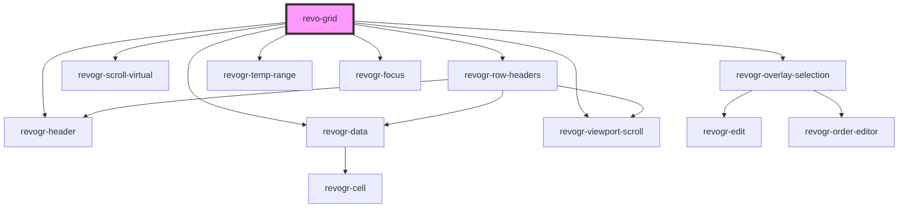

# revo-grid

<!-- Auto Generated Below -->

## Overview

Slots

## Properties

| Property             | Attribute           | Description                                                                                                                                                                                                                                             | Type                                                                                                                                                                                                                                             | Default     |
| -------------------- | ------------------- | ------------------------------------------------------------------------------------------------------------------------------------------------------------------------------------------------------------------------------------------------------- | ------------------------------------------------------------------------------------------------------------------------------------------------------------------------------------------------------------------------------------------------ | ----------- |
| `additionalData`     | `additional-data`   | Additional data to be passed to plugins, renders, editors                                                                                                                                                                                               | `any`                                                                                                                                                                                                                                            | `{}`        |
| `applyOnClose`       | `apply-on-close`    | Apply changes typed in editor on editor close except Escape cases If custom editor in use @method getValue required Check interfaces.d.ts @EditorBase for more info                                                                                     | `boolean`                                                                                                                                                                                                                                        | `false`     |
| `autoSizeColumn`     | `auto-size-column`  | Autosize config Enable columns autoSize, for more details check @autoSizeColumn plugin By default disabled, hence operation is not resource efficient true to enable with default params (double header separator click for autosize) or provide config | `boolean \| { mode?: ColumnAutoSizeMode; allColumns?: boolean; letterBlockSize?: number; preciseSize?: boolean; }`                                                                                                                               | `false`     |
| `canFocus`           | `can-focus`         | When true cell focus appear.                                                                                                                                                                                                                            | `boolean`                                                                                                                                                                                                                                        | `true`      |
| `canMoveColumns`     | `can-move-columns`  | Enables column move plugin Can be boolean                                                                                                                                                                                                               | `boolean`                                                                                                                                                                                                                                        | `false`     |
| `colSize`            | `col-size`          | Indicates default column size.                                                                                                                                                                                                                          | `number`                                                                                                                                                                                                                                         | `100`       |
| `columnTypes`        | --                  | Column Types Format Every type represent multiple column properties Types will be merged but can be replaced with column properties Types were made as separate objects to be reusable per multiple columns                                             | `{ [name: string]: ColumnType; }`                                                                                                                                                                                                                | `{}`        |
| `columns`            | --                  | Columns - defines an array of grid columns. Can be column or grouped column.                                                                                                                                                                            | `(ColumnRegular \| ColumnGrouping)[]`                                                                                                                                                                                                            | `[]`        |
| `disableVirtualX`    | `disable-virtual-x` | Disable lazy rendering mode for the X axis Use when not many columns present and you don't need rerenader cells during scroll                                                                                                                           | `boolean`                                                                                                                                                                                                                                        | `false`     |
| `disableVirtualY`    | `disable-virtual-y` | Disable lazy rendering mode for the Y axis Use when not many rows present and you don't need rerenader cells during scroll                                                                                                                              | `boolean`                                                                                                                                                                                                                                        | `false`     |
| `editors`            | --                  | Custom editors register                                                                                                                                                                                                                                 | `{ [name: string]: EditorCtr; }`                                                                                                                                                                                                                 | `{}`        |
| `exporting`          | `exporting`         | Enables export plugin Can be boolean Can be export options                                                                                                                                                                                              | `boolean`                                                                                                                                                                                                                                        | `false`     |
| `filter`             | `filter`            | Enables filter plugin Can be boolean Can be filter collection                                                                                                                                                                                           | `boolean \| { collection?: FilterCollection; include?: string[]; customFilters?: Record<string, CustomFilter>; filterProp?: string; localization?: FilterLocalization; multiFilterItems?: MultiFilterItem; disableDynamicFiltering?: boolean; }` | `false`     |
| `focusTemplate`      | --                  | Apply changes typed in editor on editor close except Escape cases If custom editor in use @method getValue required Check interfaces.d.ts @EditorBase for more info                                                                                     | `(createElement: HyperFunc<VNode>, detail: FocusRenderEvent) => any`                                                                                                                                                                             | `undefined` |
| `frameSize`          | `frame-size`        | Defines how many rows/columns should be rendered outside visible area.                                                                                                                                                                                  | `number`                                                                                                                                                                                                                                         | `1`         |
| `grouping`           | --                  | Group models by provided properties Define properties to be groped by                                                                                                                                                                                   | `{ props?: ColumnProp[]; expandedAll?: boolean; groupLabelTemplate?: GroupLabelTemplateFunc; }`                                                                                                                                                  | `undefined` |
| `pinnedBottomSource` | --                  | Pinned bottom Source: {[T in ColumnProp]: any} - defines pinned bottom rows data source.                                                                                                                                                                | `DataType[]`                                                                                                                                                                                                                                     | `[]`        |
| `pinnedTopSource`    | --                  | Pinned top Source: {[T in ColumnProp]: any} - defines pinned top rows data source.                                                                                                                                                                      | `DataType[]`                                                                                                                                                                                                                                     | `[]`        |
| `plugins`            | --                  | Custom grid plugins Has to be predefined during first grid init Every plugin should be inherited from BasePlugin                                                                                                                                        | `(typeof Plugin)[]`                                                                                                                                                                                                                              | `undefined` |
| `range`              | `range`             | When true, user can range selection.                                                                                                                                                                                                                    | `boolean`                                                                                                                                                                                                                                        | `false`     |
| `readonly`           | `readonly`          | When true, grid in read only mode.                                                                                                                                                                                                                      | `boolean`                                                                                                                                                                                                                                        | `false`     |
| `resize`             | `resize`            | When true, columns are resizable.                                                                                                                                                                                                                       | `boolean`                                                                                                                                                                                                                                        | `false`     |
| `rowClass`           | `row-class`         | Row class property Define this property in rgRow object and this will be mapped as rgRow class                                                                                                                                                          | `string`                                                                                                                                                                                                                                         | `''`        |
| `rowDefinitions`     | --                  | Row properies applied                                                                                                                                                                                                                                   | `RowDefinition[]`                                                                                                                                                                                                                                | `[]`        |
| `rowHeaders`         | `row-headers`       | Excel like show rgRow indexe per rgRow                                                                                                                                                                                                                  | `RowHeaders \| boolean`                                                                                                                                                                                                                          | `undefined` |
| `rowSize`            | `row-size`          | Indicates default rgRow size. By default 0, means theme package size will be applied                                                                                                                                                                    | `number`                                                                                                                                                                                                                                         | `0`         |
| `source`             | --                  | Source - defines main data source. Can be an Object or 2 dimensional array([][]); Keys/indexes referenced from columns Prop                                                                                                                             | `DataType[]`                                                                                                                                                                                                                                     | `[]`        |
| `stretch`            | `stretch`           | Defines stretch strategy for columns with @StretchColumn plugin if there are more space on the right last column size would be increased                                                                                                                | `boolean \| string`                                                                                                                                                                                                                              | `true`      |
| `theme`              | `theme`             | Theme name                                                                                                                                                                                                                                              | `"compact" \| "darkCompact" \| "darkMaterial" \| "default" \| "material"`                                                                                                                                                                        | `'default'` |
| `trimmedRows`        | --                  | Trimmed rows Functionality which allows to hide rows from main data set                                                                                                                                                                                 | `{ [x: number]: boolean; }`                                                                                                                                                                                                                      | `{}`        |
| `useClipboard`       | `use-clipboard`     | When true enable clipboard.                                                                                                                                                                                                                             | `boolean`                                                                                                                                                                                                                                        | `true`      |

## Events

| Event                      | Description                                                                                                                                                                                                     | Type                                                                                                                                                                                                                                          |
| -------------------------- | --------------------------------------------------------------------------------------------------------------------------------------------------------------------------------------------------------------- | --------------------------------------------------------------------------------------------------------------------------------------------------------------------------------------------------------------------------------------------- |
| `after-any-source`         | After all rows updated. Use it if you want to track all changes from sources pinned and main                                                                                                                    | `CustomEvent<{ type: DimensionRows; source: DataType[]; }>`                                                                                                                                                                                   |
| `aftercolumnresize`        | After column resize Get resized columns                                                                                                                                                                         | `CustomEvent<{ [index: number]: ColumnRegular; }>`                                                                                                                                                                                            |
| `aftercolumnsset`          | Column updated                                                                                                                                                                                                  | `CustomEvent<{ columns: ColumnCollection; order: Record<ColumnProp, "asc" \| "desc">; }>`                                                                                                                                                     |
| `afteredit`                | After edit. Triggered after data applied or range changed.                                                                                                                                                      | `CustomEvent<{ data: DataLookup; models: { [rowIndex: number]: DataType; }; type: DimensionRows; } \| { prop: ColumnProp; model: DataType; val?: string; rowIndex: number; colIndex: number; colType: DimensionCols; type: DimensionRows; }>` |
| `afterfocus`               | Triggered after focus render finished. Can be used to access a focus element through @event.target                                                                                                              | `CustomEvent<{ model: any; column: ColumnRegular; }>`                                                                                                                                                                                         |
| `aftersourceset`           | After rows updated                                                                                                                                                                                              | `CustomEvent<{ type: DimensionRows; source: DataType[]; }>`                                                                                                                                                                                   |
| `aftertrimmed`             | Notify trimmed applied                                                                                                                                                                                          | `CustomEvent<any>`                                                                                                                                                                                                                            |
| `before-any-source`        | Before data apply. You can override data source here                                                                                                                                                            | `CustomEvent<{ type: DimensionRows; source: DataType[]; }>`                                                                                                                                                                                   |
| `beforeange`               | Before range apply. Triggered before range applied. Use e.preventDefault() to prevent range.                                                                                                                    | `CustomEvent<{ type: DimensionRows; colType: DimensionCols; newRange: RangeArea; oldRange: RangeArea; mapping: OldNewRangeMapping; newData: { [key: number]: DataType; }; }>`                                                                 |
| `beforeautofill`           | Before autofill. Triggered before autofill applied. Use e.preventDefault() to prevent edit data apply.                                                                                                          | `CustomEvent<{ type: DimensionRows; colType: DimensionCols; newRange: RangeArea; oldRange: RangeArea; mapping: OldNewRangeMapping; newData: { [key: number]: DataType; }; }>`                                                                 |
| `beforecellfocus`          | Before cell focus changed. Use e.preventDefault() to prevent cell focus change.                                                                                                                                 | `CustomEvent<{ prop: ColumnProp; model: DataType; val?: string; rowIndex: number; colIndex: number; colType: DimensionCols; type: DimensionRows; }>`                                                                                          |
| `beforecolumnapplied`      | Before column applied but after column set gathered and viewport updated                                                                                                                                        | `CustomEvent<{ columns: Record<DimensionCols, ColumnRegular[]>; columnByProp: Record<ColumnProp, ColumnRegular[]>; columnGrouping: ColumnGrouping; maxLevel: number; sort: Record<ColumnProp, ColumnRegular>; }>`                             |
| `beforecolumnsset`         | Before column update                                                                                                                                                                                            | `CustomEvent<{ columns: Record<DimensionCols, ColumnRegular[]>; columnByProp: Record<ColumnProp, ColumnRegular[]>; columnGrouping: ColumnGrouping; maxLevel: number; sort: Record<ColumnProp, ColumnRegular>; }>`                             |
| `beforeedit`               | Before edit event. Triggered before edit data applied. Use e.preventDefault() to prevent edit data set and use you own. Use e.val = {your value} to replace edit result with your own.                          | `CustomEvent<{ prop: ColumnProp; model: DataType; val?: string; rowIndex: number; colIndex: number; colType: DimensionCols; type: DimensionRows; }>`                                                                                          |
| `beforeeditstart`          | Before edit started Use e.preventDefault() to prevent edit                                                                                                                                                      | `CustomEvent<{ prop: ColumnProp; model: DataType; val?: string; rowIndex: number; colIndex: number; colType: DimensionCols; type: DimensionRows; }>`                                                                                          |
| `beforeexport`             | Before export Use e.preventDefault() to prevent export Replace data in Event in case you want to modify it in export                                                                                            | `CustomEvent<{ data: DataType[]; } & ColSource>`                                                                                                                                                                                              |
| `beforefilterapply`        | Before filter applied to data source Use e.preventDefault() to prevent cell focus change Update @collection if you wish to change filters                                                                       | `CustomEvent<{ collection: FilterCollection; }>`                                                                                                                                                                                              |
| `beforefiltertrimmed`      | Before filter trimmed values Use e.preventDefault() to prevent value trimming and filter apply Update @collection if you wish to change filters Update @itemsToFilter if you wish to filter indexes of trimming | `CustomEvent<{ collection: FilterCollection; itemsToFilter: Record<number, boolean>; }>`                                                                                                                                                      |
| `beforefocuslost`          | Before grid focus lost happened. Use e.preventDefault() to prevent cell focus change.                                                                                                                           | `CustomEvent<{ model: any; cell: Cell; colType: DimensionCols; rowType: DimensionRows; column?: ColumnRegular; }>`                                                                                                                            |
| `beforerangeedit`          | Before range edit event. Triggered before range data applied, when range selection happened. Use e.preventDefault() to prevent edit data set and use you own.                                                   | `CustomEvent<{ data: DataLookup; models: { [rowIndex: number]: DataType; }; type: DimensionRows; }>`                                                                                                                                          |
| `beforerowdefinition`      | Before row definition                                                                                                                                                                                           | `CustomEvent<{ vals: any; oldVals: any; }>`                                                                                                                                                                                                   |
| `beforesorting`            | Before sorting event. Initial sorting triggered, if this event stops no other event called. Use e.preventDefault() to prevent sorting.                                                                          | `CustomEvent<{ column: ColumnRegular; order: "asc" \| "desc"; additive: boolean; }>`                                                                                                                                                          |
| `beforesortingapply`       | Before sorting apply. Use e.preventDefault() to prevent sorting data change.                                                                                                                                    | `CustomEvent<{ column: ColumnRegular; order: "asc" \| "desc"; additive: boolean; }>`                                                                                                                                                          |
| `beforesourceset`          | Before data apply. You can override data source here                                                                                                                                                            | `CustomEvent<{ type: DimensionRows; source: DataType[]; }>`                                                                                                                                                                                   |
| `beforesourcesortingapply` | Before source update sorting apply. Use this event if you intended to prevent sorting on data update. Use e.preventDefault() to prevent sorting data change during rows source update.                          | `CustomEvent<any>`                                                                                                                                                                                                                            |
| `beforetrimmed`            | Before trimmed values Use e.preventDefault() to prevent value trimming Update @trimmed if you wish to filter indexes of trimming                                                                                | `CustomEvent<{ trimmed: Record<number, boolean>; trimmedType: string; type: string; }>`                                                                                                                                                       |
| `contentsizechanged`       | contentsizechanged event. Triggered when new content size applied. Not including header size Event is not returning size To get actual size use getContentSize after event triggered                            | `CustomEvent<"colPinEnd" \| "colPinStart" \| "rgCol" \| "rgRow" \| "rowPinEnd" \| "rowPinStart">`                                                                                                                                             |
| `filterconfigchanged`      | External subscribe                                                                                                                                                                                              | `CustomEvent<any>`                                                                                                                                                                                                                            |
| `headerclick`              | On header click.                                                                                                                                                                                                | `CustomEvent<ColumnRegular>`                                                                                                                                                                                                                  |
| `rowdragstart`             | Row order change started. Use e.preventDefault() to prevent rgRow order change. Use e.text = 'new name' to change item name on start.                                                                           | `CustomEvent<{ pos: PositionItem; text: string; }>`                                                                                                                                                                                           |
| `rowheaderschanged`        |                                                                                                                                                                                                                 | `CustomEvent<any>`                                                                                                                                                                                                                            |
| `roworderchanged`          | Before rgRow order apply. Use e.preventDefault() to prevent rgRow order change.                                                                                                                                 | `CustomEvent<{ from: number; to: number; }>`                                                                                                                                                                                                  |
| `viewportscroll`           | Triggered when view port scrolled                                                                                                                                                                               | `CustomEvent<{ dimension: DimensionType; coordinate: number; delta?: number; outside?: boolean; }>`                                                                                                                                           |

## Methods

### `addTrimmed(trimmed: Record<number, boolean>, trimmedType?: string, type?: RevoGrid.DimensionRows) => Promise<CustomEvent<{ trimmed: Record<number, boolean>; trimmedType: string; type: string; }>>`

Add trimmed by type

#### Returns

Type: `Promise<CustomEvent<{ trimmed: Record<number, boolean>; trimmedType: string; type: string; }>>`

### `clearFocus() => Promise<void>`

Clear current grid focus

#### Returns

Type: `Promise<void>`

### `clearSorting() => Promise<void>`

Clears column sorting

#### Returns

Type: `Promise<void>`

### `getColumnStore(type?: RevoGrid.DimensionCols) => Promise<ColumnSource>`

Provides access to column internal store observer
Can be used for plugin support

#### Returns

Type: `Promise<ColumnSource>`

### `getColumns() => Promise<RevoGrid.ColumnRegular[]>`

Receive all columns in data source

#### Returns

Type: `Promise<ColumnRegular[]>`

### `getContentSize() => Promise<Selection.Cell>`

Get size of content
Including all pinned data

#### Returns

Type: `Promise<Cell>`

### `getFocused() => Promise<FocusedData | null>`

Get the currently focused cell.

#### Returns

Type: `Promise<FocusedData>`

### `getPlugins() => Promise<RevoPlugin.Plugin[]>`

Get all active plugins instances

#### Returns

Type: `Promise<Plugin[]>`

### `getSelectedRange() => Promise<Selection.RangeArea | null>`

Get the currently selected Range.

#### Returns

Type: `Promise<RangeArea>`

### `getSource(type?: RevoGrid.DimensionRows) => Promise<RevoGrid.DataType[]>`

Get data from source

#### Returns

Type: `Promise<DataType[]>`

### `getSourceStore(type?: RevoGrid.DimensionRows) => Promise<RowSource>`

Provides access to rows internal store observer
Can be used for plugin support

#### Returns

Type: `Promise<RowSource>`

### `getVisibleSource(type?: RevoGrid.DimensionRows) => Promise<any[]>`

Get data from visible part of source
Trimmed/filtered rows will be excluded

#### Returns

Type: `Promise<any[]>`

### `refresh(type?: RevoGrid.DimensionRows | 'all') => Promise<void>`

Refreshes data viewport.
Can be specific part as rgRow or pinned rgRow or 'all' by default.

#### Returns

Type: `Promise<void>`

### `registerVNode(elements: VNode[]) => Promise<void>`

Register new virtual node inside of grid
Used for additional items creation such as plugin elements

#### Returns

Type: `Promise<void>`

### `scrollToColumnIndex(coordinate?: number) => Promise<void>`

Scrolls view port to specified column index

#### Returns

Type: `Promise<void>`

### `scrollToColumnProp(prop: RevoGrid.ColumnProp) => Promise<void>`

Scrolls view port to specified column prop

#### Returns

Type: `Promise<void>`

### `scrollToCoordinate(cell: Partial<Selection.Cell>) => Promise<void>`

Scrolls view port to coordinate

#### Returns

Type: `Promise<void>`

### `scrollToRow(coordinate?: number) => Promise<void>`

Scrolls view port to specified rgRow index

#### Returns

Type: `Promise<void>`

### `setCellEdit(rgRow: number, prop: RevoGrid.ColumnProp, rowSource?: RevoGrid.DimensionRows) => Promise<void>`

Bring cell to edit mode

#### Returns

Type: `Promise<void>`

### `setCellsFocus(cellStart?: Selection.Cell, cellEnd?: Selection.Cell, colType?: string, rowType?: string) => Promise<void>`

Set focus range

#### Returns

Type: `Promise<void>`

### `updateColumnSorting(column: RevoGrid.ColumnRegular, index: number, order: 'asc' | 'desc', additive: boolean) => Promise<RevoGrid.ColumnRegular>`

Update column sorting

#### Returns

Type: `Promise<ColumnRegular>`

### `updateColumns(cols: RevoGrid.ColumnRegular[]) => Promise<void>`

Update columns

#### Returns

Type: `Promise<void>`

## Slots

| Slot                                 | Description |
| ------------------------------------ | ----------- |
| `"data-{column-type}-{row-type}."`   |             |
| `"focus-${view.type}-${data.type}."` |             |

## Dependencies

### Depends on

- [revogr-row-headers](../rowHeaders)
- [revogr-scroll-virtual](../scrollable)
- [revogr-header](../header)
- [revogr-overlay-selection](../overlay)
- [revogr-data](../data)
- [revogr-temp-range](../selectionTempRange)
- [revogr-focus](../selectionFocus)
- [revogr-viewport-scroll](../scroll)

### Graph

----------------------------------------------

*Built with [StencilJS](https://stenciljs.com/)*
