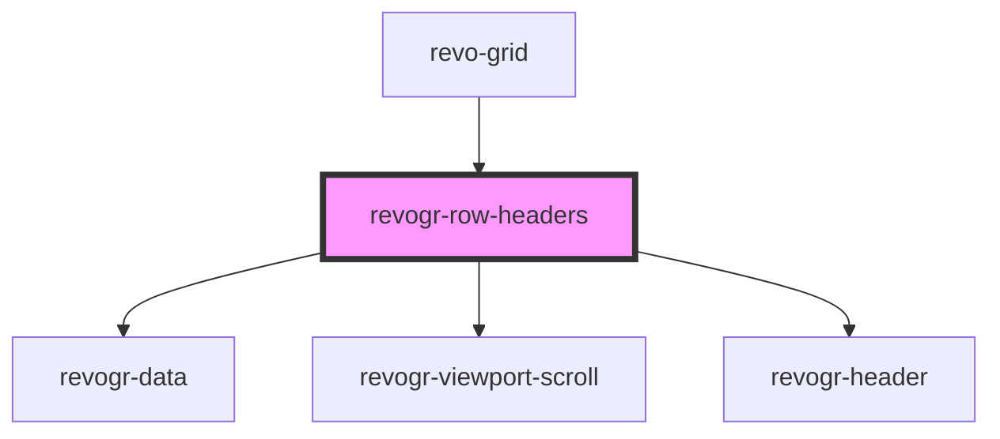

# revogr-row-headers

<!-- Auto Generated Below -->

## Overview

Row headers component
Visible on the left side of the table

## Properties

| Property          | Attribute   | Description | Type                    | Default     |
| ----------------- | ----------- | ----------- | ----------------------- | ----------- |
| `dataPorts`       | --          |             | `ViewportData[]`        | `undefined` |
| `headerProp`      | --          |             | `{ [x: string]: any; }` | `undefined` |
| `height`          | `height`    |             | `number`                | `undefined` |
| `resize`          | `resize`    |             | `boolean`               | `undefined` |
| `rowClass`        | `row-class` |             | `string`                | `undefined` |
| `rowHeaderColumn` | --          |             | `RowHeaders`            | `undefined` |
| `uiid`            | `uiid`      |             | `string`                | `undefined` |

## Events

| Event             | Description | Type                                                                                                |
| ----------------- | ----------- | --------------------------------------------------------------------------------------------------- |
| `elementToScroll` |             | `CustomEvent<ElementScroll>`                                                                        |
| `scrollViewport`  |             | `CustomEvent<{ dimension: DimensionType; coordinate: number; delta?: number; outside?: boolean; }>` |

## Dependencies

### Used by

 - [revo-grid](../revoGrid)

### Depends on

- [revogr-data](../data)
- [revogr-viewport-scroll](../scroll)
- [revogr-header](../header)

### Graph

----------------------------------------------

*Built with [StencilJS](https://stenciljs.com/)*
