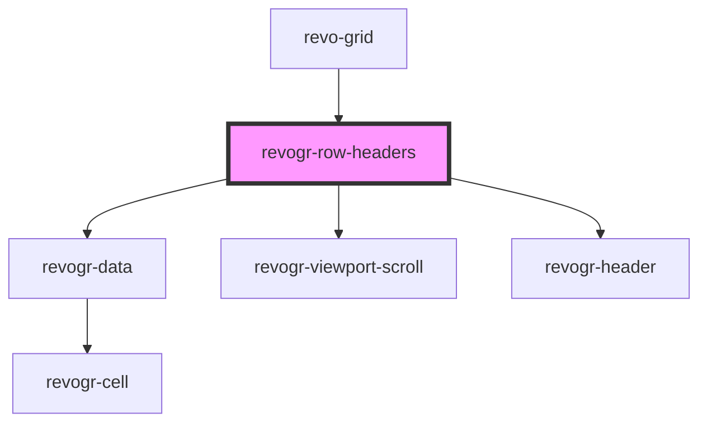

# revogr-row-headers

<!-- Auto Generated Below -->

## Overview

Row headers component
Visible on the left side of the table

## Properties

| Property          | Attribute         | Description                         | Type                    | Default     |
| ----------------- | ----------------- | ----------------------------------- | ----------------------- | ----------- |
| `additionalData`  | `additional-data` | Additional data to pass to renderer | `any`                   | `undefined` |
| `dataPorts`       | --                | Viewport data                       | `ViewportData[]`        | `undefined` |
| `headerProp`      | --                | Header props                        | `{ [x: string]: any; }` | `undefined` |
| `height`          | `height`          | Header height to setup row headers  | `number`                | `undefined` |
| `resize`          | `resize`          | Enable resize                       | `boolean`               | `undefined` |
| `rowClass`        | `row-class`       | Row class                           | `string`                | `undefined` |
| `rowHeaderColumn` | --                | Row header column                   | `RowHeaders`            | `undefined` |

## Events

| Event        | Description                | Type                                                                                                |
| ------------ | -------------------------- | --------------------------------------------------------------------------------------------------- |
| `ref`        | Register element to scroll | `CustomEvent<ElementScroll>`                                                                        |
| `scrollview` | Scroll viewport            | `CustomEvent<{ dimension: DimensionType; coordinate: number; delta?: number; outside?: boolean; }>` |

## Dependencies

### Used by

 - [revo-grid](../revoGrid)

### Depends on

- [revogr-data](../data)
- [revogr-viewport-scroll](../scroll)
- [revogr-header](../header)

### Graph

----------------------------------------------

*Built with love by Revolist OU*
