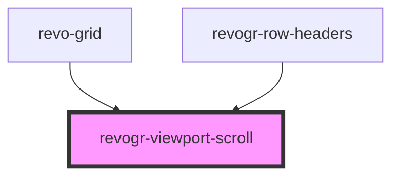

# revogr-viewport-scroll

<!-- Auto Generated Below -->

## Overview

Viewport scroll component for RevoGrid

## Properties

| Property        | Attribute        | Description             | Type      | Default     |
| --------------- | ---------------- | ----------------------- | --------- | ----------- |
| `contentHeight` | `content-height` | Height of inner content | `number`  | `0`         |
| `contentWidth`  | `content-width`  | Width of inner content  | `number`  | `0`         |
| `rowHeader`     | `row-header`     | Enable row header       | `boolean` | `undefined` |

## Events

| Event                  | Description                                                                         | Type                                                                                                |
| ---------------------- | ----------------------------------------------------------------------------------- | --------------------------------------------------------------------------------------------------- |
| `resizeviewport`       | Viewport resize                                                                     | `CustomEvent<{ dimension: DimensionType; size: number; rowHeader?: boolean; }>`                     |
| `scrollchange`         | Triggered on scroll change, can be used to get information about scroll visibility  | `CustomEvent<{ type: DimensionType; hasScroll: boolean; }>`                                         |
| `scrollviewport`       | Before scroll event                                                                 | `CustomEvent<{ dimension: DimensionType; coordinate: number; delta?: number; outside?: boolean; }>` |
| `scrollviewportsilent` | Silently scroll to coordinate Made to align negative coordinates for mobile devices | `CustomEvent<{ dimension: DimensionType; coordinate: number; delta?: number; outside?: boolean; }>` |

## Methods

### `applyScroll(type: DimensionType, e: UIEvent) => Promise<void>`

Extra layer for scroll event monitoring, where MouseWheel event is not passing
We need to trigger scroll event in case there is no mousewheel event

#### Parameters

| Name   | Type                 | Description |
| ------ | -------------------- | ----------- |
| `type` | `"rgCol" \| "rgRow"` |             |
| `e`    | `UIEvent`            |             |

#### Returns

Type: `Promise<void>`

### `changeScroll(e: ViewPortScrollEvent, silent?: boolean) => Promise<ViewPortScrollEvent>`

update on delta in case we don't know existing position or external change

#### Parameters

| Name     | Type                                                                                   | Description |
| -------- | -------------------------------------------------------------------------------------- | ----------- |
| `e`      | `{ dimension: DimensionType; coordinate: number; delta?: number; outside?: boolean; }` |             |
| `silent` | `boolean`                                                                              |             |

#### Returns

Type: `Promise<ViewPortScrollEvent>`

### `setScroll(e: ViewPortScrollEvent) => Promise<void>`

#### Parameters

| Name | Type                                                                                   | Description |
| ---- | -------------------------------------------------------------------------------------- | ----------- |
| `e`  | `{ dimension: DimensionType; coordinate: number; delta?: number; outside?: boolean; }` |             |

#### Returns

Type: `Promise<void>`

## Slots

| Slot       | Description |
| ---------- | ----------- |
|            | content     |
| `"footer"` | footer      |
| `"header"` | header      |

## Dependencies

### Used by

 - [revo-grid](../revoGrid)
 - [revogr-row-headers](../rowHeaders)

### Graph

----------------------------------------------

*Built with love by Revolist OU*
