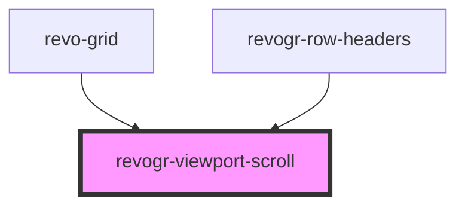

# revogr-viewport-scroll

<!-- Auto Generated Below -->

## Properties

| Property        | Attribute        | Description             | Type      | Default     |
| --------------- | ---------------- | ----------------------- | --------- | ----------- |
| `contentHeight` | `content-height` | Height of inner content | `number`  | `0`         |
| `contentWidth`  | `content-width`  | Width of inner content  | `number`  | `0`         |
| `rowHeader`     | `row-header`     |                         | `boolean` | `undefined` |

## Events

| Event            | Description                                                                         | Type                                                                                                |
| ---------------- | ----------------------------------------------------------------------------------- | --------------------------------------------------------------------------------------------------- |
| `resizeViewport` |                                                                                     | `CustomEvent<{ dimension: DimensionType; size: number; rowHeader?: boolean; }>`                     |
| `scrollchange`   |                                                                                     | `CustomEvent<{ type: DimensionType; hasScroll: boolean; }>`                                         |
| `scrollViewport` |                                                                                     | `CustomEvent<{ dimension: DimensionType; coordinate: number; delta?: number; outside?: boolean; }>` |
| `silentScroll`   | Silently scroll to coordinate Made to align negative coordinates for mobile devices | `CustomEvent<{ dimension: DimensionType; coordinate: number; delta?: number; outside?: boolean; }>` |

## Methods

### `changeScroll(e: RevoGrid.ViewPortScrollEvent, silent?: boolean) => Promise<RevoGrid.ViewPortScrollEvent>`

update on delta in case we don't know existing position or external change

#### Returns

Type: `Promise<ViewPortScrollEvent>`

### `onScroll(type: RevoGrid.DimensionType, e: UIEvent) => Promise<void>`

Extra layer for scroll event monitoring, where MouseWheel event is not passing
We need to trigger scroll event in case there is no mousewheel event

#### Returns

Type: `Promise<void>`

### `setScroll(e: RevoGrid.ViewPortScrollEvent) => Promise<void>`

#### Returns

Type: `Promise<void>`

## Dependencies

### Used by

 - [revo-grid](../revoGrid)
 - [revogr-row-headers](../rowHeaders)

### Graph

----------------------------------------------

*Built with [StencilJS](https://stenciljs.com/)*
