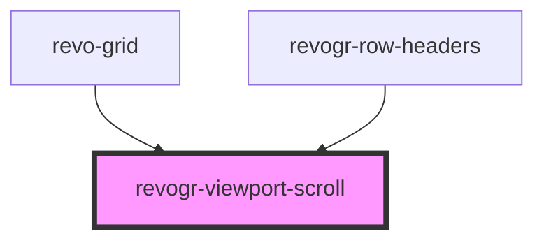

# revogr-viewport-scroll

<!-- Auto Generated Below -->

## Properties

| Property        | Attribute        | Description             | Type     | Default |
| --------------- | ---------------- | ----------------------- | -------- | ------- |
| `contentHeight` | `content-height` | Height of inner content | `number` | `0`     |
| `contentWidth`  | `content-width`  | Width of inner content  | `number` | `0`     |

## Events

| Event            | Description | Type                                                                                                |
| ---------------- | ----------- | --------------------------------------------------------------------------------------------------- |
| `resizeViewport` |             | `CustomEvent<{ dimension: DimensionType; size: number; }>`                                          |
| `scrollchange`   |             | `CustomEvent<{ type: DimensionType; hasScroll: boolean; }>`                                         |
| `scrollViewport` |             | `CustomEvent<{ dimension: DimensionType; coordinate: number; delta?: number; outside?: boolean; }>` |

## Methods

### `changeScroll(e: RevoGrid.ViewPortScrollEvent) => Promise<RevoGrid.ViewPortScrollEvent>`

update on delta in case we don't know existing position or external change

#### Returns

Type: `Promise<ViewPortScrollEvent>`

### `setScroll(e: RevoGrid.ViewPortScrollEvent) => Promise<void>`

#### Returns

Type: `Promise<void>`

## Dependencies

### Used by

 - [revo-grid](../revoGrid)
 - [revogr-row-headers](../rowHeaders)

### Graph

----------------------------------------------

*Built with [StencilJS](https://stenciljs.com/)*
