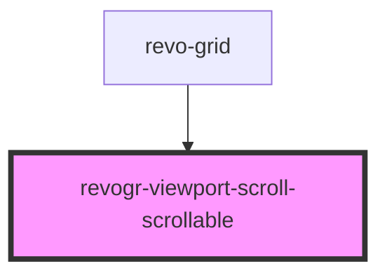

# viewport-scrollable-component

<!-- Auto Generated Below -->

## Methods

### `scrollX(x?: number) => Promise<void>`

#### Returns

Type: `Promise<void>`

### `scrollY(y?: number) => Promise<void>`

#### Returns

Type: `Promise<void>`

## Dependencies

### Used by

 - [revo-grid](../revo-grid)

### Graph

----------------------------------------------

*Built with [StencilJS](https://stenciljs.com/)*
