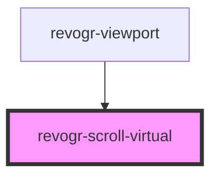

# viewport-scrollable-component

<!-- Auto Generated Below -->

## Properties

| Property      | Attribute      | Description | Type             | Default |
| ------------- | -------------- | ----------- | ---------------- | ------- |
| `contentSize` | `content-size` |             | `number`         | `0`     |
| `dimension`   | `dimension`    |             | `"col" \| "row"` | `'row'` |
| `virtualSize` | `virtual-size` |             | `number`         | `0`     |

## Events

| Event           | Description | Type                                                             |
| --------------- | ----------- | ---------------------------------------------------------------- |
| `scrollVirtual` |             | `CustomEvent<{ dimension: DimensionType; coordinate: number; }>` |

## Methods

### `setScroll(e: RevoGrid.ViewPortScrollEvent) => Promise<void>`

#### Returns

Type: `Promise<void>`

## Dependencies

### Used by

 - [revogr-viewport](../viewport)

### Graph

----------------------------------------------

*Built with [StencilJS](https://stenciljs.com/)*
