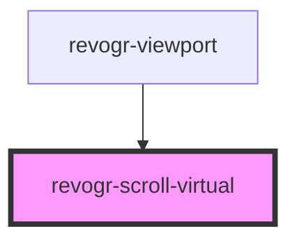

# viewport-scrollable-component

<!-- Auto Generated Below -->

## Properties

| Property         | Attribute   | Description | Type                                    | Default     |
| ---------------- | ----------- | ----------- | --------------------------------------- | ----------- |
| `dimension`      | `dimension` |             | `"col" \| "row"`                        | `'row'`     |
| `dimensionStore` | --          |             | `ObservableMap<DimensionSettingsState>` | `undefined` |
| `viewportStore`  | --          |             | `ObservableMap<ViewportState>`          | `undefined` |

## Events

| Event           | Description | Type                                                                             |
| --------------- | ----------- | -------------------------------------------------------------------------------- |
| `scrollVirtual` |             | `CustomEvent<{ dimension: DimensionType; coordinate: number; delta?: number; }>` |

## Methods

### `changeScroll(e: RevoGrid.ViewPortScrollEvent) => Promise<RevoGrid.ViewPortScrollEvent>`

#### Returns

Type: `Promise<ViewPortScrollEvent>`

### `setScroll(e: RevoGrid.ViewPortScrollEvent) => Promise<void>`

#### Returns

Type: `Promise<void>`

## Dependencies

### Used by

 - [revogr-viewport](../viewport)

### Graph

----------------------------------------------

*Built with [StencilJS](https://stenciljs.com/)*
