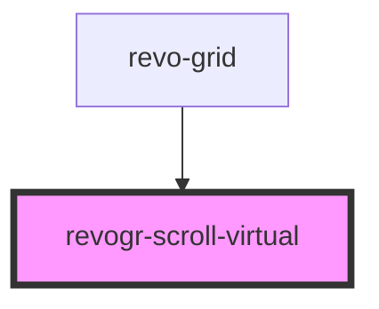

# viewport-scrollable-component

<!-- Auto Generated Below -->

## Overview

Virtual scroll component

## Properties

| Property                      | Attribute   | Description                                       | Type                                    | Default     |
| ----------------------------- | ----------- | ------------------------------------------------- | --------------------------------------- | ----------- |
| `dimension`                   | `dimension` | Scroll dimension (`X` - `rgCol` or `Y` - `rgRow`) | `"rgCol" \| "rgRow"`                    | `'rgRow'`   |
| `dimensionStore` _(required)_ | --          | Dimensions                                        | `ObservableMap<DimensionSettingsState>` | `undefined` |
| `viewportStore` _(required)_  | --          | Viewport                                          | `ObservableMap<ViewportState>`          | `undefined` |

## Events

| Event           | Description  | Type                                                                                                |
| --------------- | ------------ | --------------------------------------------------------------------------------------------------- |
| `scrollvirtual` | Scroll event | `CustomEvent<{ dimension: DimensionType; coordinate: number; delta?: number; outside?: boolean; }>` |

## Methods

### `changeScroll(e: ViewPortScrollEvent) => Promise<ViewPortScrollEvent>`

Update if `delta` exists in case we don't know current position or if it's external change

#### Parameters

| Name | Type                                                                                   | Description |
| ---- | -------------------------------------------------------------------------------------- | ----------- |
| `e`  | `{ dimension: DimensionType; coordinate: number; delta?: number; outside?: boolean; }` |             |

#### Returns

Type: `Promise<ViewPortScrollEvent>`

### `setScroll(e: ViewPortScrollEvent) => Promise<void>`

#### Parameters

| Name | Type                                                                                   | Description |
| ---- | -------------------------------------------------------------------------------------- | ----------- |
| `e`  | `{ dimension: DimensionType; coordinate: number; delta?: number; outside?: boolean; }` |             |

#### Returns

Type: `Promise<void>`

## Dependencies

### Used by

 - [revo-grid](../revoGrid)

### Graph

----------------------------------------------

*Built with love by Revolist OU*
