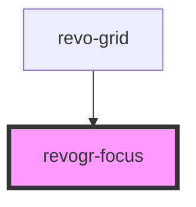

# revogr-focus

<!-- Auto Generated Below -->

## Properties

| Property                      | Attribute | Description    | Type                                                      | Default     |
| ----------------------------- | --------- | -------------- | --------------------------------------------------------- | ----------- |
| `dataStore` _(required)_      | --        | Dynamic stores | `ObservableMap<DataSourceState<DataType, DimensionRows>>` | `undefined` |
| `dimensionCol` _(required)_   | --        |                | `ObservableMap<DimensionSettingsState>`                   | `undefined` |
| `dimensionRow` _(required)_   | --        |                | `ObservableMap<DimensionSettingsState>`                   | `undefined` |
| `selectionStore` _(required)_ | --        |                | `ObservableMap<SelectionStoreState>`                      | `undefined` |

## Events

| Event        | Description | Type                           |
| ------------ | ----------- | ------------------------------ |
| `afterfocus` |             | `CustomEvent<{ model: any; }>` |

## Dependencies

### Used by

 - [revo-grid](../revo-grid)

### Graph

----------------------------------------------

*Built with [StencilJS](https://stenciljs.com/)*
